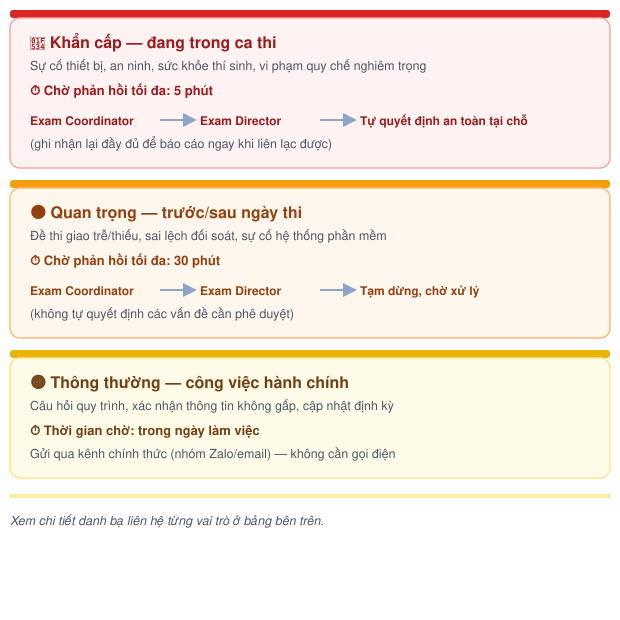

# Danh bạ liên hệ & Escalation


Bảng liên hệ dưới đây đang để **placeholder** — cần điền số điện thoại/Zalo/email thật trước khi áp dụng chính thức. Quy tắc leo thang là **đề xuất ban đầu**, cần Exam Director xác nhận hoặc điều chỉnh thời gian chờ cho phù hợp thực tế.


## 📇 Danh bạ liên hệ

| Vai trò | Điện thoại | Zalo | Email |
| --- | --- | --- | --- |
| [Exam Director](../03-roles/exam-director.md) | _(placeholder)_ | _(placeholder)_ | _(placeholder)_ |
| [Exam Coordinator](../03-roles/exam-coordinator.md) | _(placeholder)_ | _(placeholder)_ | _(placeholder)_ |
| [Exam Operations Team](../03-roles/exam-operations-team/README.md) (nhóm chung) | _(placeholder)_ | _(placeholder)_ | — |
| [Technical Team](../03-roles/exam-operations-team/technical-team.md) (sự cố thiết bị) | _(placeholder)_ | _(placeholder)_ | — |
| Đơn vị vận chuyển đề thi (DHL) | _(placeholder)_ | — | _(placeholder)_ |
| ÖSD (đầu mối liên hệ) | _(placeholder)_ | — | _(placeholder)_ |

Mỗi trang vai trò cũng có sẵn khối "📞 Liên hệ" riêng — bấm vào tên vai trò ở bất kỳ Bước nào trong Handbook sẽ dẫn tới đúng trang có thông tin liên hệ tương ứng.

***

## ⏱️ Quy tắc leo thang (đề xuất)

<figure><figcaption>
3 mức độ leo thang
</figcaption></figure>

Chi tiết từng mức:


### 🔴 Khẩn cấp — đang trong ca thi

**Ví dụ:** sự cố thiết bị làm gián đoạn phòng thi, sự cố an ninh, sức khỏe thí sinh, nghi vấn vi phạm quy chế nghiêm trọng.

**Thời gian chờ phản hồi:** tối đa **5 phút**.

**Thứ tự leo thang:**

1. Gọi Exam Coordinator.
2. Không phản hồi sau 5 phút → gọi Exam Director.
3. Vẫn không liên lạc được → người tại hiện trường (Room Coordinator/Technical Team/Invigilator tùy tình huống) **tự quyết định phương án an toàn tạm thời**, ưu tiên đảm bảo an toàn cho thí sinh, và ghi nhận lại đầy đủ để báo cáo ngay khi liên lạc được.



### 🟠 Quan trọng — trước/sau ngày thi

**Ví dụ:** đề thi giao trễ/thiếu, sai lệch khi đối soát, sự cố hệ thống phần mềm.

**Thời gian chờ phản hồi:** tối đa **30 phút**.

**Thứ tự leo thang:**

1. Gọi hoặc nhắn Exam Coordinator.
2. Không phản hồi sau 30 phút → gọi Exam Director.
3. Vẫn không liên lạc được → tạm dừng thao tác có rủi ro (không tự quyết định các vấn đề cần phê duyệt), ghi nhận lại và xử lý ngay khi liên lạc được.



### 🟡 Thông thường — công việc hành chính

**Ví dụ:** câu hỏi về quy trình, xác nhận thông tin không gấp, cập nhật tiến độ định kỳ.

**Thời gian chờ phản hồi:** trong ngày làm việc.

**Cách xử lý:** gửi qua kênh chính thức (nhóm Zalo/email), không cần gọi điện trực tiếp.


***

## 📎 Tài liệu liên quan


[risk-register.md](../05-risk-management/risk-register.md)



[Giới thiệu Handbook](muc-tieu-va-cach-su-dung.md)

