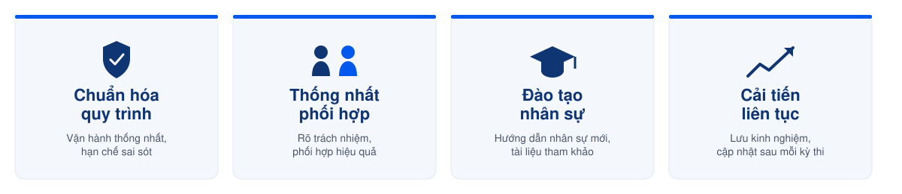

# Giới thiệu Handbook

Handbook là **nguồn tài liệu chính thức** về quy trình tổ chức kỳ thi ÖSD tại **Phuong Nam Education (PNE)**.

Tài liệu được xây dựng nhằm chuẩn hóa cách vận hành kỳ thi, thống nhất cách phối hợp giữa các bộ phận và lưu trữ tri thức để phục vụ đào tạo, bàn giao công việc và cải tiến liên tục.

---

## 🎯 Mục tiêu

---

## 🎓 Phạm vi áp dụng

Handbook hiện áp dụng cho các trình độ ÖSD đang được tổ chức tại PNE: **A1, A2, B1, B2**.


### Khi trung tâm mở thêm trình độ mới (ví dụ B2+, C1)

- Khung giờ chuẩn và thời lượng từng kỹ năng cần được ÖSD xác nhận và cập nhật vào [Kế hoạch kỳ thi](../04-templates-checklists/ke-hoach-ky-thi.md).
- Rà soát lại nguyên tắc sắp xếp lịch thi tại [Bước 3](../02-processes/buoc-03-sap-xep-lich-thi.md) — đặc biệt quy tắc ghép cặp thi Nói (hiện áp dụng theo A1-B2, có thể khác với trình độ cao hơn).
- Cập nhật số lượng/loại biểu mẫu chấm điểm nếu trình độ mới có cấu trúc bài thi khác.


***

## 📚 Nội dung của Handbook

<table data-view="cards">
<thead>
<tr>
<th></th>
<th></th>
<th></th>
<th data-hidden data-card-target data-type="content-ref"></th>
</tr>
</thead>
<tbody>

<tr>
<td>Quy trình</td>
<td><strong>Quy trình tổ chức kỳ thi</strong></td>
<td>Hướng dẫn toàn bộ 12 bước từ lập kế hoạch đến tổng kết.</td>
<td><a href="../02-processes/tong-quan-quy-trinh.md">Quy trình</a></td>
</tr>

<tr>
<td>Vai trò</td>
<td><strong>Vai trò & Phân quyền</strong></td>
<td>Mô tả trách nhiệm và phạm vi công việc của từng vị trí.</td>
<td><a href="../03-roles/README.md">Vai trò</a></td>
</tr>

<tr>
<td>Biểu mẫu</td>
<td><strong>Biểu mẫu</strong></td>
<td>Các biểu mẫu sử dụng trong quá trình vận hành.</td>
<td><a href="../04-templates-checklists/bieu-mau.md">Biểu mẫu</a></td>
</tr>

<tr>
<td>Checklist</td>
<td><strong>Checklist</strong></td>
<td>Các checklist sử dụng trong từng bước của kỳ thi.</td>
<td><a href="../04-templates-checklists/checklist.md">Checklist</a></td>
</tr>

<tr>
<td>Rủi ro</td>
<td><strong>Quản lý rủi ro</strong></td>
<td>Danh mục rủi ro và nguyên tắc xử lý.</td>
<td><a href="../05-risk-management/risk-register.md">Rủi ro</a></td>
</tr>

<tr>
<td>Thuật ngữ</td>
<td><strong>Thuật ngữ</strong></td>
<td>Giải thích các thuật ngữ được sử dụng trong Handbook.</td>
<td><a href="../06-glossary/thuat-ngu.md">Thuật ngữ</a></td>
</tr>

</tbody>
</table>

---

## 🧭 Cách sử dụng




### Xác định vai trò

Đọc **Vai trò & Phân quyền** để hiểu phạm vi trách nhiệm của vị trí bạn đảm nhiệm.




### Xác định giai đoạn

Chọn đúng giai đoạn của kỳ thi để tra cứu quy trình tương ứng.




### Thực hiện theo quy trình

Thực hiện lần lượt các bước trong quy trình và sử dụng đúng biểu mẫu, checklist được liên kết tại từng trang.




### Tra cứu

Sử dụng **Ctrl + K** (Windows) hoặc **⌘ + K** (macOS) để tìm nhanh quy trình, vai trò hoặc biểu mẫu.





---

## ⚠️ Nguyên tắc sử dụng


- Handbook là tài liệu tham khảo chính thức trong quá trình tổ chức kỳ thi.
- Chỉ sử dụng phiên bản đang được công bố trên GitBook.
- Không tự ý chỉnh sửa quy trình khi chưa được phê duyệt.
- Mọi đề xuất cải tiến cần được tổng hợp sau kỳ thi và cập nhật theo quy trình quản lý tài liệu.


---

## 🔄 Cập nhật tài liệu


Handbook được rà soát sau mỗi kỳ thi hoặc khi có thay đổi từ ÖSD, quy định nội bộ hoặc yêu cầu cải tiến.

Mọi thay đổi đều được ghi nhận trong **Lịch sử thay đổi** của từng tài liệu.


---

## 📎 Tài liệu liên quan


[tong-quan-quy-trinh.md](../02-processes/tong-quan-quy-trinh.md)



[README.md](../03-roles/README.md)



[bieu-mau.md](../04-templates-checklists/bieu-mau.md)



[checklist.md](../04-templates-checklists/checklist.md)

