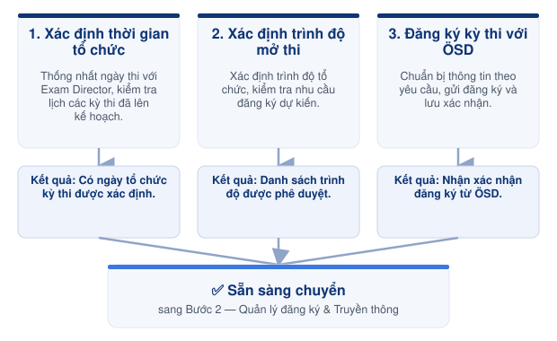

# Bước 1 — Lập kế hoạch & đăng ký



<h4 align="center">📅 <strong>Thời điểm</strong></h4>

Trước ngày thi 1,5–2 tháng



{% column width="33.33333333333333%" %}
<h4 align="center">👤 <strong>Phụ trách</strong></h4>

<a href="../03-roles/exam-coordinator.md">Exam Coordinator</a>



{% column width="33.33333333333333%" %}
<h4 align="center">✅ <strong>Phê duyệt</strong></h4>

<a href="../03-roles/exam-director.md">Exam Director</a>




***

### 👥 Vai trò & Trách nhiệm

| Vai trò                                             | Trách nhiệm                             |
| --------------------------------------------------- | --------------------------------------- |
| [Exam Director](../03-roles/exam-director.md)       | Phê duyệt kế hoạch kỳ thi.              |
| [Exam Coordinator](../03-roles/exam-coordinator.md) | Lập kế hoạch và đăng ký kỳ thi với ÖSD. |

### 📋 Chuẩn bị

* 📄 Kế hoạch tổ chức kỳ thi.
* 👥 Nhu cầu mở kỳ thi.
* 📅 Lịch tổ chức dự kiến.
* 📃 Thông tin đăng ký theo yêu cầu của ÖSD.

***

<figure><figcaption>
Luồng lập kế hoạch &#x26; đăng ký kỳ thi
</figcaption></figure>

***

## 📖 Hướng dẫn thực hiện




### Xác định thời gian tổ chức


* Trao đổi với Exam Director để thống nhất thời gian tổ chức.
* Kiểm tra lịch các kỳ thi đã lên kế hoạch.
* Xác nhận ngày thi phù hợp với lịch hoạt động của trung tâm.


{% column width="33.33333333333333%" %}

### Xác định trình độ mở thi


* Xác định các trình độ sẽ tổ chức.
* Kiểm tra nhu cầu đăng ký dự kiến.
* Thống nhất danh sách trình độ với Exam Director.


{% column width="33.33333333333333%" %}

### Đăng ký kỳ thi với ÖSD


* Chuẩn bị thông tin theo yêu cầu của ÖSD.
* Gửi đăng ký theo quy định.
* Lưu thông tin xác nhận sau khi đăng ký thành công.






**Kết quả:** Có ngày tổ chức kỳ thi được xác định.





**Kết quả:** Danh sách trình độ được phê duyệt.





**Kết quả:** Nhận xác nhận đăng ký từ ÖSD.




***




### Checklist hoàn thành

* [ ] Đã xác định ngày tổ chức kỳ thi.
* [ ] Đã xác định các trình độ mở thi.
* [ ] Đã được Exam Director phê duyệt.
* [ ] Đã đăng ký kỳ thi với ÖSD.
* [ ] Đã lưu xác nhận đăng ký.





### Hoàn thành khi

* Kế hoạch kỳ thi được Exam Director phê duyệt.
* Kỳ thi được đăng ký thành công với ÖSD.
* Sẵn sàng triển khai bước **Quản lý đăng ký kỳ thi**.





### Lưu ý

* Chỉ công bố thông tin kỳ thi sau khi nhận xác nhận từ ÖSD.
* Lưu toàn bộ email và tài liệu xác nhận để đối chiếu khi cần.


***

## 📎 Tài liệu liên quan




[buoc-02-quan-ly-va-truyen-thong.md](buoc-02-quan-ly-va-truyen-thong.md)




Quy định đăng ký kỳ thi của ÖSD _(tài liệu bên ngoài — chưa có link nội bộ)_


