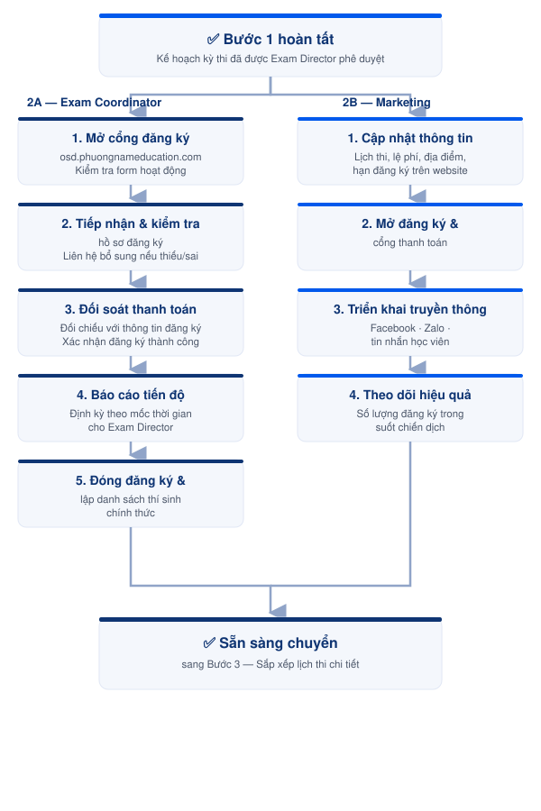

# Bước 2 — Quản lý đăng ký & Truyền thông kỳ thi



<h4 align="center">📅 <strong>Thời điểm</strong></h4>

Bắt đầu ngay sau khi hoàn thành [Bước 1. Lập kế hoạch kỳ thi](buoc-01-lap-ke-hoach-dang-ky.md) và kết thúc khi đóng đăng ký.


{% column width="33.33333333333333%" %}
<h4 align="center">👤 <strong>Phụ trách</strong></h4>

2A: <a href="../03-roles/exam-coordinator.md">Exam Coordinator</a>

2B: <a href="../03-roles/marketing.md">Phòng Marketing</a>



{% column width="33.33333333333333%" %}
<h4 align="center">✅ <strong>Phê duyệt</strong></h4>

<a href="../03-roles/exam-director.md">Exam Director</a>




***



### 2A · Quản lý đăng ký kỳ thi



### 2B · Truyền thông kỳ thi





| Vai trò                                             | Trách nhiệm                                                                             |
| --------------------------------------------------- | --------------------------------------------------------------------------------------- |
| [Exam Coordinator](../03-roles/exam-coordinator.md) | Quản lý đăng ký, xử lý hồ sơ, đối soát thanh toán và lập danh sách thí sinh chính thức. |



<table><thead><tr><th width="141.9296875">Vai trò</th><th>Trách nhiệm</th></tr></thead><tbody><tr><td><a href="../03-roles/marketing.md">Phòng Marketing</a></td><td>Triển khai truyền thông và theo dõi hiệu quả đăng ký.</td></tr></tbody></table>




{% column width="50%" %}

### Chuẩn bị


* Kế hoạch kỳ thi đã được phê duyệt.
* Thông tin kỳ thi đã sẵn sàng để mở đăng ký.
* Cổng đăng ký hoạt động bình thường.


{% column width="50%" %}

### **Chuẩn bị**


* Kế hoạch kỳ thi đã được phê duyệt.
* Thông tin kỳ thi đã được xác nhận.
* Nội dung truyền thông đã sẵn sàng.



***

<figure><figcaption>
Luồng quản lý đăng ký &#x26; truyền thông kỳ thi (2A &#x26; 2B)
</figcaption></figure>

***




### Hướng dẫn thực hiện


1. **Mở đăng ký kỳ thi** — Mở cổng đăng ký tại `https://osd.phuongnameducation.com/`. Kiểm tra trạng thái hoạt động của biểu mẫu và thông tin hiển thị.
2. **Tiếp nhận hồ sơ đăng ký** — Tiếp nhận hồ sơ từ thí sinh, theo dõi danh sách đăng ký trong suốt thời gian mở cổng.
3. **Kiểm tra hồ sơ** — Kiểm tra tính đầy đủ, hợp lệ; liên hệ thí sinh bổ sung nếu thiếu/sai thông tin.
4. **Đối soát thanh toán** — Kiểm tra trạng thái thanh toán, đối chiếu với thông tin đăng ký.
5. **Xác nhận đăng ký** — Xác nhận thành công sau khi hồ sơ hợp lệ và thanh toán hoàn tất.
6. **Báo cáo tiến độ đăng ký** cho Exam Director:
   * Trước kỳ thi hơn 1 tháng: báo cáo 2 tuần/lần.
   * Trước kỳ thi 1 tháng: báo cáo số lượng đăng ký với ÖSD.
   * Trước kỳ thi dưới 1 tháng: cập nhật 3–5 ngày/lần, hoặc hằng ngày khi cần.
7. **Báo cáo lịch thi** — Báo cáo dự kiến phân bổ phòng thi và thời gian thi cho Exam Director.
8. **Đóng đăng ký** — Đóng cổng đăng ký theo kế hoạch.
9. **Lập danh sách thí sinh chính thức** — Tổng hợp và hoàn thiện danh sách thí sinh đủ điều kiện.




### Hướng dẫn thực hiện


1. **Cập nhật thông tin kỳ thi** trên website: lịch thi, lệ phí, địa điểm, hạn đăng ký.
2. **Mở đăng ký** — Mở cổng đăng ký và cổng thanh toán.
3. **Triển khai truyền thông** trên các kênh của công ty: Facebook, Zalo, tin nhắn đến học viên.
4. **Theo dõi hiệu quả** — Theo dõi số lượng đăng ký trong suốt thời gian diễn ra chiến dịch.



###




### Checklist hoàn thành

* [ ] Cổng đăng ký đã được mở.
* [ ] Tất cả hồ sơ đã được kiểm tra.
* [ ] Hồ sơ thiếu hoặc sai đã được xử lý.
* [ ] Thanh toán đã được đối soát.
* [ ] Thí sinh đủ điều kiện đã được xác nhận.
* [ ] Báo cáo tiến độ đã gửi Exam Director.
* [ ] Đăng ký đã được đóng.
* [ ] Danh sách thí sinh chính thức đã hoàn thành.





### Checklist hoàn thành

* [ ] Thông tin kỳ thi đã được cập nhật.
* [ ] Cổng đăng ký và thanh toán đã hoạt động.
* [ ] Chiến dịch truyền thông đã triển khai.
* [ ] Số lượng đăng ký được theo dõi và cập nhật.







### Hoàn thành khi

* Danh sách thí sinh chính thức đầy đủ, chính xác.
* Hoàn tất công tác đăng ký trước ngày thi.





### Hoàn thành khi

* Thông tin kỳ thi được công bố trên các kênh truyền thông.
* Chiến dịch truyền thông được triển khai theo kế hoạch.







### Lưu ý

* Theo dõi hồ sơ và thanh toán xuyên suốt thời gian mở đăng ký.
* Cập nhật tiến độ đúng tần suất để Exam Director theo dõi tình hình.





### Lưu ý

* Đảm bảo thông tin trên mọi kênh thống nhất, chính xác.
* Phối hợp với Exam Coordinator khi có thay đổi lịch thi hoặc thời gian đăng ký.




***

## Tài liệu liên quan




[buoc-01-lap-ke-hoach-dang-ky.md](buoc-01-lap-ke-hoach-dang-ky.md)





[buoc-03-sap-xep-lich-thi.md](buoc-03-sap-xep-lich-thi.md)





[bang-phan-cong.md](bang-phan-cong.md)



