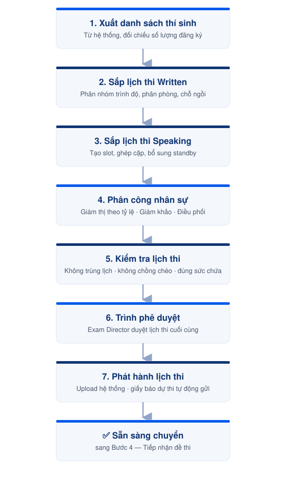

---
layout:
  width: wide
  title:
    visible: true
  description:
    visible: true
  tableOfContents:
    visible: true
  outline:
    visible: false
  pagination:
    visible: true
  metadata:
    visible: false
  tags:
    visible: true
  actions:
    visible: true
---

# Bước 3 — Sắp xếp lịch thi chi tiết

Lập lịch thi chi tiết cho từng kỹ năng, phân công nhân sự và phát hành lịch thi cho thí sinh trước ngày thi.



#### 📅 **Thời điểm**&#x20;

Trước ngày thi 5–7 ngày



#### 👤 **Phụ trách**&#x20;

[Exam Coordinator](../03-roles/exam-coordinator.md)



#### ✅ **Phê duyệt**&#x20;

[Exam Director](../03-roles/exam-director.md)



***

### 👥 Vai trò & Trách nhiệm

<table><thead><tr><th width="266.5">Vai trò</th><th>Trách nhiệm</th></tr></thead><tbody><tr><td><a href="../03-roles/exam-coordinator.md">Exam Coordinator</a></td><td>Lập lịch thi, phân công nhân sự, phát hành lịch thi; kiểm tra và cập nhật lịch thi theo yêu cầu chỉnh sửa trước khi trình phê duyệt.</td></tr><tr><td><a href="../03-roles/exam-director.md">Exam Director</a></td><td>Phê duyệt lịch thi cuối cùng.</td></tr></tbody></table>


### Chuẩn bị


**Dữ liệu**

* Xuất danh sách thí sinh từ hệ thống `osd.phuongnameducation.com` sau khi kết thúc đăng ký.
* Kiểm tra số lượng thí sinh và thông tin đăng ký trước khi bắt đầu phân lịch.

**Thông tin cần chuẩn bị**

* Danh sách thí sinh chính thức.
* Danh sách [Giám khảo](../03-roles/examiner.md).
* Danh sách [Giám thị](../03-roles/invigilator.md).
* Danh sách phòng thi.
* Khung thời gian thi của từng trình độ.

***


### Lịch thi

* Hoàn thành lịch thi **Written** trước khi bắt đầu sắp xếp lịch **Speaking**.
* Ưu tiên bố trí thí sinh thi Written trước, sau đó mới đến Speaking.
* Đối với trình độ **B2**, hai module Written và Speaking không được tổ chức trong cùng một ngày.



### Các kỹ năng/Module Viết

* Phân lịch theo từng trình độ.
* Mỗi phòng tối đa **30 thí sinh**.
* Không quy định số lượng tối thiểu.
* Không sử dụng phòng dự phòng.
* Không bố trí các thí sinh có **cùng họ** ngồi gần nhau trong cùng phòng thi.



### Kỹ năng/Module Nói

* A1 thi cá nhân.
* A2, B1 và B2 thi theo cặp.
* Ưu tiên ghép 01 nam và 01 nữ trong cùng một cặp để thuận tiện cho việc nhận diện khi chấm và đối chiếu bản ghi âm.
* Có thể bổ sung thí sinh standby theo số lượng đăng ký với ÖSD.


### Phòng thi

| Phòng | Chức năng      |
| ----- | -------------- |
| 11    | Viết           |
| 12    | Viết           |
| 14    | Nói            |
| 15    | Phòng chuẩn bị |

***

<figure><figcaption>
Luồng sắp xếp lịch thi chi tiết
</figcaption></figure>

***


## Hướng dẫn thực hiện


### 1. Xuất danh sách thí sinh

1. Xuất danh sách thí sinh từ hệ thống `osd.phuongnameducation.com`.
2. Lưu file Excel theo quy định.
3. Đối chiếu số lượng thí sinh với danh sách đăng ký.
4. Kiểm tra thông tin trước khi bắt đầu phân lịch.

### 2. Sắp xếp lịch thi Written

**Khung thời gian:** Sử dụng khung thời gian của từng trình độ theo kế hoạch kỳ thi.

**Thực hiện:**

1. Phân nhóm thí sinh theo trình độ.
2. Phân bổ thí sinh vào phòng thi.
3. Kiểm tra sức chứa của từng phòng.
4. Bố trí chỗ ngồi theo quy tắc sắp xếp.
5. Xác nhận thời gian thi theo đúng khung giờ.
6. Hoàn thiện lịch thi Written.

### 3. Sắp xếp lịch thi Speaking

**Thời lượng**

| Trình độ | Thời gian chuẩn bị | Thời gian thi |
| -------- | -----------------: | ------------: |
| A1       |            10 phút |       10 phút |
| A2       |            10 phút |       15 phút |
| B1       |            15 phút |       20 phút |
| B2       |            15 phút |       25 phút |

**Giám khảo**

* 02 Giám khảo cho mỗi ca thi.
* Exam Director là Giám khảo dự phòng.
* Một Giám khảo làm việc tối đa 08 giờ/ngày.
* Giám khảo có thể làm việc liên tục trong ca.

**Điều phối**

* 01 người điều phối, phụ trách đồng thời phòng Speaking và phòng chuẩn bị.

**Thực hiện:**

1. Tạo các slot thi theo số lượng thí sinh.
2. Ghép cặp thí sinh theo quy tắc sắp xếp.
3. Bổ sung thí sinh standby (nếu cần).
4. Phân công Giám khảo.
5. Phân công người điều phối.
6. Bố trí thời gian nghỉ giữa các ca (nếu có).
7. Hoàn thiện lịch thi Speaking.

### 4. Phân công nhân sự

**Written**

* Mỗi 15 thí sinh bố trí 01 Giám thị.
* Phòng đủ 30 thí sinh bố trí 02 Giám thị.

**Speaking**

* 02 Giám khảo.
* 01 Điều phối.
* 01 Giám khảo dự phòng (Exam Director).

### 5. Kiểm tra lịch thi

Trước khi trình phê duyệt, xác nhận:

* Không có thí sinh trùng lịch.
* Không có khung giờ bị chồng chéo.
* Công thức tính thời gian trên file hoạt động chính xác.
* Tất cả thí sinh đã được phân lịch.
* Không vượt sức chứa phòng thi.
* Đúng thời lượng của từng kỹ năng.
* Đúng trình độ dự thi.

### 6. Trình phê duyệt

<table><thead><tr><th width="268.28515625">Vai trò</th><th>Trách nhiệm</th></tr></thead><tbody><tr><td><a href="../03-roles/exam-coordinator.md">Exam Coordinator</a></td><td>Kiểm tra lần cuối; cập nhật lịch thi theo yêu cầu chỉnh sửa (nếu có).</td></tr><tr><td><a href="../03-roles/exam-director.md">Exam Director</a></td><td>Phê duyệt lịch thi.</td></tr></tbody></table>

### 7. Phát hành lịch thi

1. Upload file lịch thi lên hệ thống.
2. Kiểm tra dữ liệu sau khi upload.
3. Xác nhận hệ thống tạo lịch thi chính xác.
4. Kiểm tra thí sinh đã nhận đúng lịch thi.


Sau khi upload thành công, hệ thống sẽ tự động tạo giấy báo dự thi và gửi đến thí sinh.


### 8. Cập nhật lịch thi

**Không áp dụng:** đổi ca thi, hủy đăng ký.

**Hoãn thi:** chỉ áp dụng theo quy định của Hội đồng thi đối với các trường hợp bất khả kháng và có đầy đủ hồ sơ minh chứng.

**Thay đổi phòng thi:**

1. Cập nhật file lịch thi.
2. Upload lại lên hệ thống.
3. Gửi email thông báo cho thí sinh.
4. Gọi điện xác nhận thí sinh đã nhận được thông tin cập nhật.

***




### Checklist hoàn thành

* [ ] Danh sách thí sinh đã được chốt.
* [ ] Lịch thi Written đã hoàn thành.
* [ ] Lịch thi Speaking đã hoàn thành.
* [ ] Giám khảo đã được phân công.
* [ ] Giám thị đã được phân công.
* [ ] Phòng thi đã được xác nhận.
* [ ] Lịch thi đã được Exam Director phê duyệt.
* [ ] Lịch thi đã được upload lên hệ thống.
* [ ] Giấy báo dự thi đã được phát hành.





### Hoàn thành khi

* Tất cả thí sinh đã được phân lịch.
* Tất cả nhân sự đã được phân công.
* Lịch thi đã được Exam Director phê duyệt.
* Giấy báo dự thi đã được phát hành.
* Không còn yêu cầu điều chỉnh.





### Lưu ý

* Kiểm tra kỹ thông tin trước khi upload lịch thi lên hệ thống.
* Mọi thay đổi sau khi phát hành lịch thi phải được cập nhật trên hệ thống trước khi thông báo cho thí sinh.
* Lưu phiên bản cuối cùng của file lịch thi để phục vụ đối chiếu khi cần.


***

## 📎 Tài liệu liên quan




[buoc-02-quan-ly-va-truyen-thong.md](buoc-02-quan-ly-va-truyen-thong.md)





[buoc-04-tiep-nhan-de-thi.md](buoc-04-tiep-nhan-de-thi.md)



