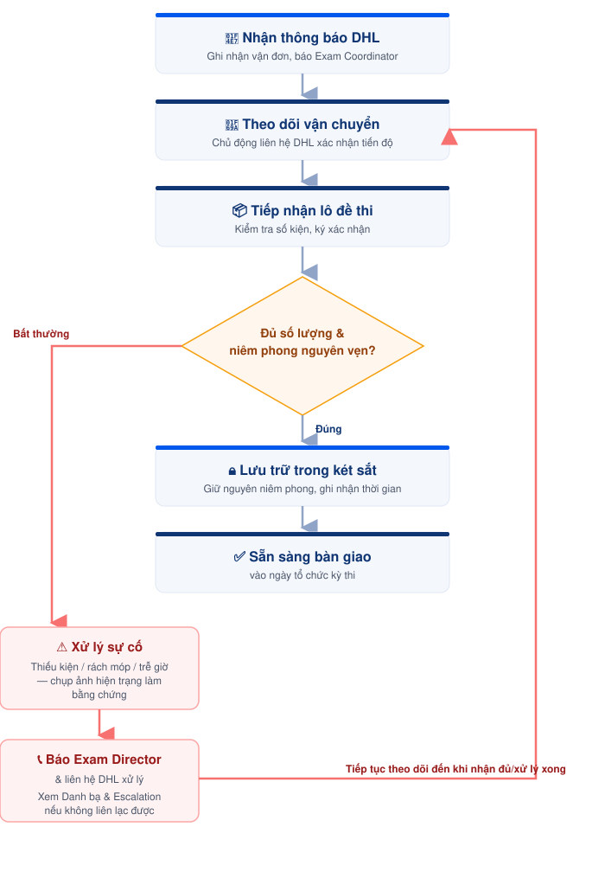

# Bước 4 — Tiếp nhận đề thi


{% column width="33.33333333333333%" %}
#### 📅 **Thời điểm**&#x20;

Trước ngày thi 2–3 tuần


{% column width="33.33333333333333%" %}
#### 👤 **Phụ trách**&#x20;

[Exam Coordinator](../03-roles/exam-coordinator.md)



#### ✅ **Phê duyệt**&#x20;

[Exam Director](../03-roles/exam-director.md)



***

### 👥 Vai trò & Trách nhiệm

| Vai trò                                                       | Trách nhiệm                                                                       |
| ------------------------------------------------------------- | --------------------------------------------------------------------------------- |
| [Exam Coordinator](../03-roles/exam-coordinator.md) | Theo dõi, tiếp nhận và lưu trữ lô đề thi.                                         |
| [Exam Director](../03-roles/exam-director.md)                 | Theo dõi tiến độ, phê duyệt việc mở niêm phong và xử lý các tình huống phát sinh. |


### Chuẩn bị&#x20;




**Thông tin**

* Email thông báo giao hàng từ DHL.
* Thông tin vận đơn (Tracking Number).
* Kế hoạch tiếp nhận lô đề thi.



**Điều kiện**

* Khu vực lưu trữ đề thi đã sẵn sàng.
* Két sắt và khu vực bảo quản hoạt động bình thường.
* Phương án tiếp nhận và bảo mật đã được chuẩn bị.



***


### 🔐 Quy định bảo mật

**Ai được tiếp cận** Chỉ [Exam Coordinator](../03-roles/exam-coordinator.md) và [Exam Director](../03-roles/exam-director.md).

**Chìa khóa / Phòng lưu trữ** Đề thi lưu trong phòng kho, trang bị 02 két sắt. Chỉ 03 nhân sự Exam Operations Team được biết chìa khóa và mật khẩu.

**Mở niêm phong** Chỉ mở niêm phong khi có Exam Director trực tiếp giám sát và cho phép.


***

<figure><figcaption>
Luồng tiếp nhận đề thi từ ÖSD
</figcaption></figure>

***

## 📖 Hướng dẫn thực hiện


### Tiếp nhận thông báo


* Kiểm tra email thông báo từ DHL, ghi nhận thông tin vận đơn và thời gian giao hàng dự kiến.
* Thông báo cho Exam Coordinator.
* Bắt đầu theo dõi trạng thái vận chuyển của lô đề thi.


### Theo dõi vận chuyển


* Theo dõi trạng thái giao hàng trong suốt quá trình vận chuyển.
* Chủ động liên hệ DHL để xác nhận tiến độ và thúc đẩy việc giao hàng đúng kế hoạch.
* Cập nhật tiến độ cho Exam Director khi có thay đổi hoặc phát sinh.


### Tiếp nhận lô đề thi


* Kiểm tra thông tin người nhận và số lượng kiện hàng theo chứng từ.
* Kiểm tra tình trạng bên ngoài của từng kiện hàng.
* Ký xác nhận sau khi hoàn tất kiểm tra.


### Kiểm tra tình trạng niêm phong


Xác nhận: đúng số lượng kiện · niêm phong còn nguyên vẹn · không rách/móp/mở · không có dấu hiệu ảnh hưởng tới đề thi bên trong.


Nếu phát hiện bất thường, thực hiện theo hướng dẫn tại mục **Xử lý tình huống**.



### Lưu trữ đề thi


* Chuyển lô đề thi vào phòng lưu trữ, bảo quản trong két sắt theo quy định.
* Giữ nguyên tình trạng niêm phong.
* Ghi nhận thời gian tiếp nhận và lưu trữ.


### ⚠️ Xử lý tình huống

**DHL giao thiếu kiện** Báo ngay Exam Director → liên hệ DHL xác minh và xử lý → theo dõi đến khi nhận đủ lô đề thi.

**Kiện hàng rách/móp** Chụp ảnh hiện trạng → báo ngay Exam Director → liên hệ DHL xử lý theo quy định.

**Giao hàng trễ** Chủ động liên hệ DHL cập nhật tiến độ → thúc đẩy giao hàng → báo cáo Exam Director đến khi nhận thành công.


***




### Checklist hoàn thành

* [ ] Đã nhận email thông báo giao hàng.
* [ ] Đã theo dõi tiến độ vận chuyển.
* [ ] Đã tiếp nhận đầy đủ lô đề thi.
* [ ] Đã kiểm tra tình trạng niêm phong.
* [ ] Đã lưu trữ đề thi trong két sắt.
* [ ] Đã cập nhật trạng thái cho Exam Director.





### Hoàn thành khi

* Lô đề thi được tiếp nhận đầy đủ.
* Niêm phong còn nguyên vẹn.
* Đề thi được lưu trữ đúng quy định.
* Đề thi sẵn sàng để bàn giao vào ngày tổ chức kỳ thi.





### Lưu ý

* Không mở niêm phong trước thời điểm được phép.
* Không để người không có thẩm quyền tiếp cận lô đề thi.
* Báo ngay cho Exam Director nếu phát hiện bất kỳ bất thường nào trong quá trình vận chuyển hoặc lưu trữ.
* Nếu không liên lạc được, xem quy tắc leo thang tại [Danh bạ liên hệ & Escalation](../00-overview/danh-ba-lien-he.md).


***

## 📎 Tài liệu liên quan




[buoc-03-sap-xep-lich-thi.md](buoc-03-sap-xep-lich-thi.md)





[buoc-05-phan-cong-va-csvc.md](buoc-05-phan-cong-va-csvc.md)



