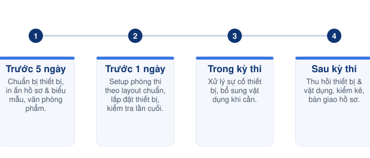

# Bước 5 — Phân công nhân sự & CSVC



#### **📅 Thời điểm**

Từ 5 ngày trước kỳ thi đến khi kết thúc bàn giao sau kỳ thi



#### 👤 **Phụ trách**

[Exam Operations Team](../03-roles/exam-operations-team/)

[Exam Coordinator](../03-roles/exam-coordinator.md)



#### ✅ **Phê duyệt**

[Exam Director](../03-roles/exam-director.md)



***

### 👥 Vai trò & Trách nhiệm

| Vai trò | Trách nhiệm |
| --- | --- |
| [Exam Coordinator](../03-roles/exam-coordinator.md) | Quyết định phương án, lập kế hoạch chuẩn bị và điều phối thực hiện. |
| [Technical Team](../03-roles/exam-operations-team/technical-team.md) | Chuẩn bị thiết bị, phần mềm. |
| Các bộ phận liên quan | Thực hiện theo phân công. |
| [Exam Director](../03-roles/exam-director.md) | Phê duyệt kế hoạch cuối cùng. |


Số lượng nhân sự cho từng vị trí (Welcome, Check-in, Locker, Security, Room Coordinator...) và số lượng thiết bị/vật dụng cần chuẩn bị **phụ thuộc vào số lượng thí sinh thực tế** của từng kỳ thi — không cố định. Exam Coordinator tính toán và điều chỉnh số lượng khi lập kế hoạch chuẩn bị.


***

<figure><figcaption>
Timeline chuẩn bị nhân sự &#x26; CSVC
</figcaption></figure>

***

## 🕐 Mốc thời gian chuẩn bị




### Trước kỳ thi 5 ngày

Kiểm tra và chuẩn bị thiết bị (laptop, tai nghe, máy quét an ninh, iPad, đường truyền mạng), in ấn hồ sơ và biểu mẫu, chuẩn bị văn phòng phẩm và vật dụng phòng thi.



### Trước kỳ thi 1 ngày

Setup từng phòng thi theo layout chuẩn, lắp đặt thiết bị tại phòng, đặt bảng chỉ dẫn, và kiểm tra toàn bộ thiết bị/hồ sơ/vật dụng lần cuối trước ngày thi.



### Trong kỳ thi

Xử lý sự cố thiết bị phát sinh, bổ sung vật dụng (giấy nháp, nước uống...) khi cần trong suốt các buổi thi.



### Sau kỳ thi

Thu hồi thiết bị và vật dụng, kiểm kê đối chiếu danh mục, thu và bàn giao hồ sơ kỳ thi.




***

## 📋 Các hạng mục cần chuẩn bị

<table data-view="cards"><thead><tr><th></th><th></th><th></th><th data-hidden data-card-target data-type="content-ref"></th></tr></thead><tbody><tr><td><h3>👥</h3></td><td><h4><strong>1. Nhân sự</strong></h4></td><td>Phân công nhiệm vụ · Xác nhận lịch làm việc · Thông báo nhân sự</td><td><a href="../04-templates-checklists/checklist-phan-cong-nhan-su.md">checklist-phan-cong-nhan-su.md</a></td></tr><tr><td><h3>🗓️</h3></td><td><h4><strong>2. Phân ca theo ngày thi</strong></h4></td><td>Lịch phân ca chi tiết theo từng buổi thi, phòng thi và vị trí</td><td><a href="../04-templates-checklists/bang-phan-ca-nhan-su.md">bang-phan-ca-nhan-su.md</a></td></tr><tr><td><h3>🏫</h3></td><td><h4><strong>3. Chuẩn bị phòng thi</strong></h4></td><td>Laptop · Tai nghe · Internet · iPad · Setup · Layout · Biển chỉ dẫn</td><td><a href="../04-templates-checklists/checklist-chuan-bi-phong-thi.md">checklist-chuan-bi-phong-thi.md</a></td></tr><tr><td><h3>📦</h3></td><td><h4><strong>4. CSVC &#x26; Thiết bị chi tiết</strong></h4></td><td>Danh mục chi tiết theo mốc thời gian · Hồ sơ · In ấn · Văn phòng phẩm · Vật dụng</td><td><a href="../04-templates-checklists/checklist-chuan-bi-csvc-thiet-bi.md">checklist-chuan-bi-csvc-thiet-bi.md</a></td></tr></tbody></table>


### Hoàn thành khi

Hoàn thành toàn bộ 4 mục trên trước khi chuyển sang [Bước 6 — Chuẩn bị đề thi](buoc-06-chuan-bi-de-thi.md).


***

## 📎 Tài liệu liên quan




[buoc-04-tiep-nhan-de-thi.md](buoc-04-tiep-nhan-de-thi.md)





[buoc-06-chuan-bi-de-thi.md](buoc-06-chuan-bi-de-thi.md)





[bieu-mau.md](../04-templates-checklists/bieu-mau.md)



[checklist.md](../04-templates-checklists/checklist.md)



