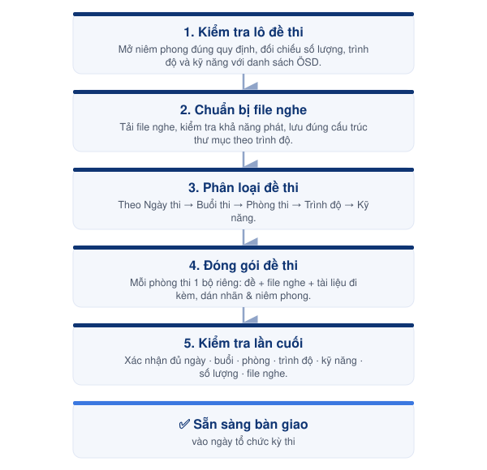

# Bước 6 — Chuẩn bị đề thi



#### 📅 Thời điểm

Thực hiện 1 ngày trước kỳ thi



#### 👤 Phụ trách

[Exam Coordinator](../03-roles/exam-coordinator.md)



#### ✅ Phê duyệt

[Exam Director](../03-roles/exam-director.md)



***

### 👥 Vai trò & Trách nhiệm

| Vai trò                                                       | Trách nhiệm                                        |
| ------------------------------------------------------------- | -------------------------------------------------- |
| [Exam Coordinator](../03-roles/exam-coordinator.md)           | Lập kế hoạch, giám sát, kiểm tra, phân loại, đóng gói và chuẩn bị đề thi.  |
| [Exam Director](../03-roles/exam-director.md)                 | Giám sát việc mở niêm phong đề thi theo quy định.  |

### 📋 Chuẩn bị



**Tài liệu**

* Lô đề thi từ ÖSD.
* Danh sách thí sinh chính thức.
* Lịch thi chi tiết.
* Danh sách phân phòng.
* Danh sách đề thi do ÖSD cung cấp.
* File nghe của các bài thi Listening.



**Điều kiện**

* Đề thi được lưu trữ đúng quy định bảo mật.
* Khu vực chuẩn bị đề thi đảm bảo an toàn.
* Chỉ những người được phân quyền mới được tham gia chuẩn bị đề thi.



***

## Quy tắc thực hiện


### 🔒 Bảo mật

* Chỉ mở niêm phong đề thi khi có Exam Director trực tiếp giám sát.
* Chỉ Exam Director và Exam Coordinator được tiếp cận đề thi trong quá trình chuẩn bị.
* Không sao chép, chụp ảnh hoặc lưu trữ đề thi dưới bất kỳ hình thức nào ngoài quy định.



### Phân loại đề thi

* Thực hiện theo thứ tự: **Ngày thi → Buổi thi → Phòng thi → Trình độ → Kỹ năng**
* Không để lẫn đề thi giữa các phòng.
* Không để lẫn đề giữa các trình độ hoặc kỹ năng.
* Mỗi phòng thi được chuẩn bị thành một bộ đề riêng.



### Đối chiếu số lượng

* Kiểm tra số lượng đề theo danh sách ÖSD.
* Đối chiếu với số lượng thí sinh của từng phòng.
* Kiểm tra đầy đủ các kỹ năng của từng trình độ.



### File nghe

* Mỗi trình độ sử dụng đúng file nghe tương ứng.
* Kiểm tra khả năng phát trước khi đóng gói.
* Lưu file nghe đúng thư mục theo từng trình độ.



### Đóng gói

* Mỗi bộ đề phải ghi rõ: Ngày thi · Buổi thi · Phòng thi · Trình độ · Kỹ năng.


***

<figure><figcaption>
Luồng chuẩn bị đề thi
</figcaption></figure>

***

## 📖 Hướng dẫn thực hiện



### Kiểm tra lô đề thi

1. Mở niêm phong theo đúng quy định.
2. Kiểm tra số lượng đề theo danh sách ÖSD.
3. Đối chiếu trình độ và kỹ năng.
4. Xác nhận tình trạng của từng bộ đề.



### 2. Chuẩn bị file nghe

1. Tải file nghe từ hệ thống ÖSD.
2. Kiểm tra khả năng phát của từng file.
3. Đối chiếu đúng trình độ và kỹ năng.
4. Lưu file theo đúng cấu trúc thư mục.



### 3. Phân loại đề thi

1. Phân loại theo ngày thi.
2. Phân loại theo buổi thi.
3. Phân loại theo phòng thi.
4. Phân loại theo trình độ.
5. Phân loại theo kỹ năng.



### 4. Đóng gói đề thi

* Chuẩn bị riêng cho từng phòng thi.&#x20;
* Mỗi bộ đề gồm:&#x20;
  * Đề thi
  * file nghe tương ứng (nếu có)
  * Tài liệu đi kèm theo quy định.&#x20;
* Dán nhãn và niêm phong sau khi hoàn tất.



### Kiểm tra lần cuối

Xác nhận số lượng đề đủ, đúng với:

* [ ] ngày thi
* [ ] buổi thi
* [ ] phòng thi
* [ ] trình độ
* [ ] kỹ năng
* [ ] số lượng đề
* [ ] file nghe.




Sau khi hoàn tất, chuyển toàn bộ đề thi về khu vực lưu trữ an toàn cho đến khi bàn giao.


***




### Checklist hoàn thành

* [ ] Đã mở niêm phong theo đúng quy định.
* [ ] Đã kiểm tra số lượng đề theo danh sách ÖSD.
* [ ] Đã đối chiếu đầy đủ trình độ và kỹ năng.
* [ ] Đã tải đầy đủ file nghe.
* [ ] Đã kiểm tra toàn bộ file nghe.
* [ ] Đã phân loại đề theo từng phòng thi.
* [ ] Đã đóng gói và dán nhãn.
* [ ] Đã kiểm tra lần cuối.
* [ ] Đã đưa đề thi về khu vực lưu trữ.





### Hoàn thành khi

* Đề thi được chuẩn bị đầy đủ cho từng phòng thi.
* File nghe được chuẩn bị đúng với từng bài thi.
* Toàn bộ đề thi được đóng gói và niêm phong theo quy định.
* Đề thi sẵn sàng bàn giao vào ngày tổ chức kỳ thi.





### Lưu ý

* Không để lẫn đề giữa các trình độ hoặc kỹ năng.
* Luôn đối chiếu số lượng đề với danh sách thí sinh trước khi đóng gói.
* Kiểm tra lại toàn bộ nhãn trên từng bộ đề trước khi niêm phong.
* Sau khi hoàn tất, đưa đề thi về khu vực lưu trữ và tiếp tục bảo quản theo quy định bảo mật.
* Nếu không liên lạc được với Exam Director khi cần giám sát mở niêm phong, xem [Danh bạ liên hệ & Escalation](../00-overview/danh-ba-lien-he.md).


***

## 📎 Tài liệu liên quan




[buoc-05-phan-cong-va-csvc.md](buoc-05-phan-cong-va-csvc.md)





[buoc-07-to-chuc-ky-thi](buoc-07-to-chuc-ky-thi/)



