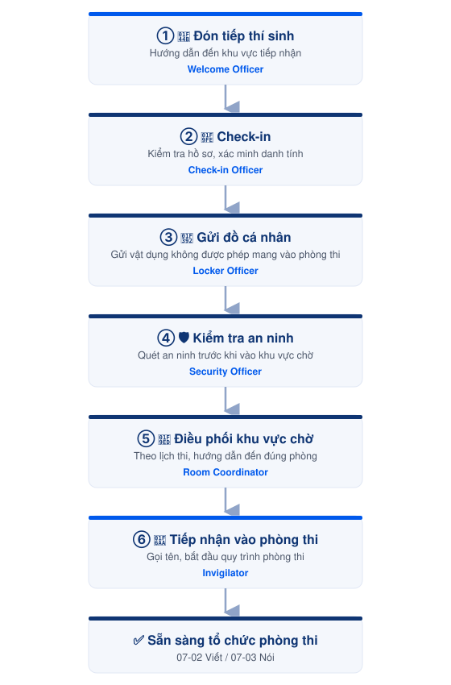

# 07-01. Quy trình tiếp nhận thí sinh



#### 📅 Thời điểm

Trước mỗi buổi thi, từ khi bắt đầu đón thí sinh đến khi toàn bộ thí sinh đã vào phòng thi.




#### 👤 Phụ trách

Exam Coordinator

Exam Operations Team

Invigilator




#### ✅ Phê duyệt

Exam Director




***

## 👥 Vai trò & Trách nhiệm

| Vai trò | Trách nhiệm |
| --- | --- |
| Exam Coordinator | Điều phối toàn bộ quy trình tiếp nhận thí sinh. |
| Welcome Officer | Đón tiếp và hướng dẫn thí sinh. |
| Check-in Officer | Kiểm tra hồ sơ và xác nhận thông tin dự thi. |
| Locker Officer | Quản lý khu vực gửi đồ cá nhân. |
| Security Officer | Kiểm tra an ninh và vật dụng mang vào phòng thi. |
| Room Coordinator | Điều phối thí sinh tại khu vực chờ và phòng thi Nói. |
| Invigilator | Tiếp nhận và hướng dẫn thí sinh vào phòng thi. |

***

## 📋 Chuẩn bị

- 📄 Danh sách thí sinh.
- 📄 Danh sách phân phòng.
- 📄 Lịch thi.
- 📄 Danh sách phân công nhân sự.
- 🏫 Khu vực tiếp nhận đã sẵn sàng.
- 🚪 Phòng thi đã sẵn sàng đón thí sinh.

### ▶️ Điều kiện bắt đầu

- Nhân sự đã có mặt đầy đủ theo phân công.
- Hồ sơ, biểu mẫu và thiết bị phục vụ tiếp nhận đã sẵn sàng.
- Các khu vực Check-in, Gửi đồ, Kiểm tra an ninh và Khu vực chờ đã sẵn sàng hoạt động.

***

## ⚠️ Quy tắc thực hiện


### Điều phối thí sinh

- Thí sinh phải hoàn thành đầy đủ từng bước của quy trình tiếp nhận trước khi chuyển sang bước tiếp theo.
- Điều phối số lượng thí sinh phù hợp với sức chứa của từng khu vực.
- Đảm bảo luồng di chuyển thông suốt, tránh ùn tắc tại các điểm tiếp nhận.



### Xử lý tình huống

- Mọi trường hợp phát sinh được xử lý theo quy định của Hội đồng thi.
- Các trường hợp vượt thẩm quyền phải báo ngay cho Exam Coordinator.


***

## 🔄 Luồng tiếp nhận thí sinh

<figure><figcaption>
6 giai đoạn tiếp nhận thí sinh
</figcaption></figure>

Chi tiết từng giai đoạn:

<strong>① Đón tiếp thí sinh</strong>

Hướng dẫn thí sinh đến đúng khu vực tiếp nhận và chuẩn bị hồ sơ theo quy định.

**👤 Phụ trách:** Welcome Officer

<strong>② Check-in</strong>

Kiểm tra hồ sơ, xác minh danh tính và hoàn tất thủ tục check-in.

**👤 Phụ trách:** Check-in Officer

<strong>③ Gửi đồ cá nhân</strong>

Hướng dẫn thí sinh gửi các vật dụng không được phép mang vào phòng thi.

**👤 Phụ trách:** Locker Officer

<strong>④ Kiểm tra an ninh</strong>

Kiểm tra an ninh và vật dụng trước khi thí sinh vào khu vực chờ.

**👤 Phụ trách:** Security Officer

<strong>⑤ Điều phối khu vực chờ</strong>

Điều phối thí sinh theo lịch thi và hướng dẫn đến đúng phòng thi.

**👤 Phụ trách:** Room Coordinator

<strong>⑥ Tiếp nhận vào phòng thi</strong>

Gọi tên, hướng dẫn thí sinh vào đúng phòng thi và bắt đầu quy trình phòng thi.

**👤 Phụ trách:** Invigilator

***





### Checklist hoàn thành

- [ ] Toàn bộ thí sinh đã hoàn tất thủ tục Check-in.
- [ ] Đã hoàn thành gửi đồ cá nhân.
- [ ] Đã hoàn tất kiểm tra an ninh.
- [ ] Đã điều phối toàn bộ thí sinh vào đúng khu vực chờ.
- [ ] Đã bàn giao toàn bộ thí sinh cho Giám thị.







### Hoàn thành khi

- Toàn bộ thí sinh đủ điều kiện đã vào đúng phòng thi.
- Không còn thí sinh tại khu vực tiếp nhận hoặc khu vực chờ.
- Sẵn sàng triển khai quy trình phòng thi.






### Lưu ý

- Quy trình này chỉ mô tả luồng tiếp nhận và điều phối thí sinh.
- Hướng dẫn thao tác chi tiết được trình bày trong Role Guide của từng vị trí.
- Các trường hợp ngoại lệ được xử lý theo quy định của Hội đồng thi và hướng dẫn của Exam Coordinator.


***

## 📎 Tài liệu liên quan






[welcome-officer.md](../../03-roles/exam-operations-team/welcome-officer.md)



[check-in-officer.md](../../03-roles/exam-operations-team/check-in-officer.md)



[locker-officer.md](../../03-roles/exam-operations-team/locker-officer.md)







[security-officer.md](../../03-roles/exam-operations-team/security-officer.md)



[room-coordinator.md](../../03-roles/exam-operations-team/room-coordinator.md)



[invigilator.md](../../03-roles/invigilator.md)







[07-02-quy-trinh-phong-thi-Viet.md](07-02-quy-trinh-phong-thi-Viet.md)



[07-03-quy-trinh-phong-thi-Noi.md](07-03-quy-trinh-phong-thi-Noi.md)

