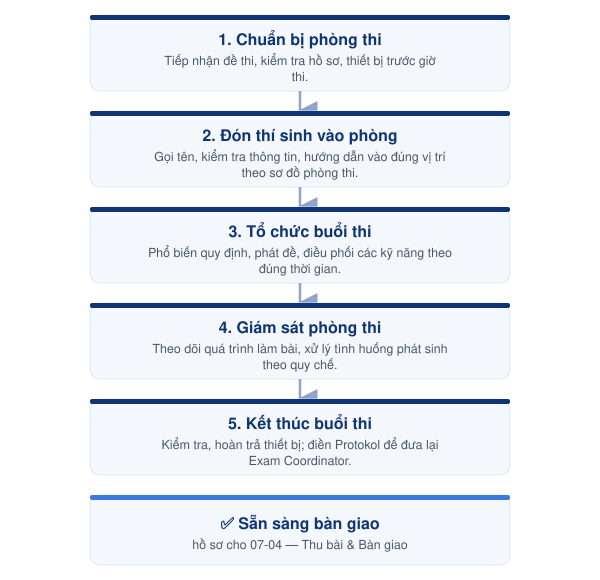

# 07-02. Quy trình phòng thi Viết



<h4 align="center">📅 Thời điểm</h4>

Trong suốt thời gian diễn ra buổi thi Viết.




<h4 align="center">👤 Phụ trách</h4>

Invigilator




<h4 align="center">✅ Phê duyệt</h4>

Exam Director




***

### 👥 Vai trò & Trách nhiệm

| Vai trò     | Trách nhiệm                                                 |
| ----------- | ----------------------------------------------------------- |
| Invigilator | Điều phối và giám sát toàn bộ hoạt động của phòng thi Viết. |

### 📋 Chuẩn bị

* 📄 Đề thi theo từng kỹ năng.
* 📄 Attendance List.
* 📄 Protokoll.
* 📄 Phiếu trả lời và giấy nháp.
* 🎧 File nghe và thiết bị phát âm thanh.
* 🏫 Phòng thi đã hoàn tất setup.

***

### ⚠️ Quy tắc thực hiện


### Đề thi

* Chỉ phát đề theo đúng thời điểm quy định.
* Đối chiếu và phát đúng mã đề cho từng cặp thí sinh.
* Không giải thích, diễn giải hoặc gợi ý nội dung đề thi.



### Điều hành phòng thi

* Chỉ sử dụng tiếng Đức trong suốt buổi thi.
* Giám sát liên tục trong thời gian làm bài.
* Ghi nhận và báo cáo các tình huống phát sinh theo quy định.



### Kết thúc buổi thi

* Thu đầy đủ bài thi và tài liệu liên quan trước khi thí sinh rời phòng.
* Kiểm đếm và hoàn tất hồ sơ trước khi bàn giao.


***

<figure><figcaption>
Luồng điều hành phòng thi Viết
</figcaption></figure>

***

## 📖 Hướng dẫn thực hiện



### Chuẩn bị phòng thi

Tiếp nhận đề thi, kiểm tra hồ sơ, thiết bị và hoàn tất công tác chuẩn bị trước giờ thi.



### Đón thí sinh vào phòng

Gọi tên, kiểm tra thông tin và hướng dẫn thí sinh vào đúng vị trí theo sơ đồ phòng thi.



### Tổ chức buổi thi

Phổ biến quy định, phát đề và điều phối các kỹ năng theo đúng thời gian quy định.



### Giám sát phòng thi

Theo dõi toàn bộ quá trình làm bài và xử lý các tình huống phát sinh theo quy chế.



### Kết thúc buổi thi

Kiểm tra, hoàn trả thiết bị. Điền đầy đủ thông tin trên Protokol để đưa lại Exam Coordinator



***




### Checklist hoàn thành

* [ ] Phòng thi đã sẵn sàng.
* [ ] Thí sinh đã vào đúng vị trí.
* [ ] Đã phổ biến quy định và phát đề.
* [ ] Buổi thi diễn ra đúng quy chế.
* [ ] Đã thu và kiểm đếm đầy đủ bài thi.





### Hoàn thành khi

* Toàn bộ bài thi và hồ sơ của phòng thi đã được kiểm đếm.
* Hoàn tất bàn giao cho quy trình **07-04. Thu bài & bàn giao**.





### Lưu ý

* Quy trình này chỉ mô tả luồng vận hành của phòng thi Viết.
* Hướng dẫn thao tác chi tiết được trình bày trong **Role Guide – Invigilator**.


***

## 📎 Tài liệu liên quan


[07-04-quy-trinh-thu-bai-va-ban-giao.md](07-04-quy-trinh-thu-bai-va-ban-giao.md)

