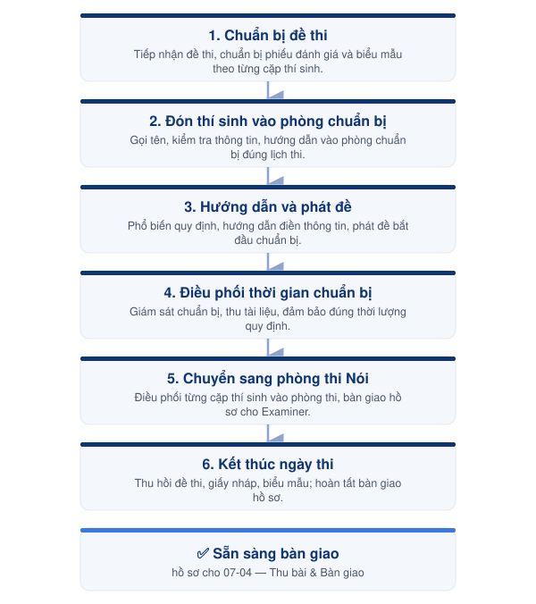

---
layout:
  width: wide
  title:
    visible: true
  description:
    visible: true
  tableOfContents:
    visible: true
  outline:
    visible: false
  pagination:
    visible: true
  metadata:
    visible: false
  tags:
    visible: true
  actions:
    visible: true
---

# 07-03. Quy trình phòng thi Nói

Tổ chức và điều phối phòng thi Nói theo đúng quy chế ÖSD, đảm bảo từng cặp thí sinh tham gia đúng thời gian, đúng trình tự và đúng quy định.



<h4 align="center">📅 Thời điểm</h4>

Trong suốt thời gian diễn ra các ca thi Nói.




<h4 align="center">👤 Phụ trách</h4>

Invigilator




<h4 align="center">✅ Phê duyệt</h4>

Exam Director




***

### 👥 Vai trò & Trách nhiệm

| Vai trò     | Trách nhiệm                                                                                |
| ----------- | ------------------------------------------------------------------------------------------ |
| Invigilator | Điều phối toàn bộ hoạt động của phòng chuẩn bị và chuyển tiếp thí sinh sang phòng thi Nói. |

### 📋 Chuẩn bị

* 📄 Đề thi theo từng cặp.
* 📄 Phiếu đánh giá.
* 📄 Phiếu xanh.
* 📄 Giấy nháp.
* 🔖 Các dấu mộc theo quy định.
* 🏫 Phòng chuẩn bị đã sẵn sàng.

***

### ⚠️ Quy tắc thực hiện


### Đề thi

* Chỉ phát đề theo đúng thời điểm quy định.
* Đối chiếu và phát đúng mã đề cho từng cặp thí sinh.
* Không giải thích, diễn giải hoặc gợi ý nội dung đề thi.



### Phòng chuẩn bị

* Điều phối đúng cặp thí sinh theo lịch thi.
* Khu vực chuẩn bị luôn giữ trật tự và tuyệt đối im lặng.
* Không để thí sinh trao đổi hoặc xem lại đề sau khi kết thúc thời gian chuẩn bị.



### Kết thúc

* Thu đầy đủ đề thi, giấy nháp và biểu mẫu.
* Chuyển đúng hồ sơ của từng cặp sang phòng thi Nói.
* Hoàn tất bàn giao sau khi kết thúc ngày thi.


***

<figure><figcaption>
Luồng điều hành phòng thi Nói
</figcaption></figure>

***

## 📖 Hướng dẫn thực hiện



### Chuẩn bị đề thi

Tiếp nhận đề thi, chuẩn bị phiếu đánh giá và các biểu mẫu theo từng cặp thí sinh.



### Đón thí sinh vào phòng chuẩn bị

Gọi tên, kiểm tra thông tin và hướng dẫn thí sinh vào phòng chuẩn bị theo đúng lịch thi.



### Hướng dẫn và phát đề

Phổ biến quy định, hướng dẫn điền thông tin và phát đề để bắt đầu thời gian chuẩn bị.



### Điều phối thời gian chuẩn bị

Giám sát quá trình chuẩn bị, thu lại tài liệu và đảm bảo đúng thời lượng quy định.



### Chuyển sang phòng thi Nói

Điều phối từng cặp thí sinh vào phòng thi và bàn giao đầy đủ hồ sơ cho Examiner.



### Kết thúc ngày thi

Thu hồi đề thi, giấy nháp, biểu mẫu và hoàn tất bàn giao hồ sơ theo quy định.



***




### Checklist hoàn thành

* [ ] Đề thi đã được chuẩn bị.
* [ ] Thí sinh đã vào đúng phòng chuẩn bị.
* [ ] Đã phổ biến quy định và phát đề.
* [ ] Đã điều phối đúng thời gian chuẩn bị.
* [ ] Đã chuyển đầy đủ hồ sơ sang phòng thi Nói.
* [ ] Đã hoàn tất bàn giao cuối ngày.





### Hoàn thành khi

* Toàn bộ các cặp thí sinh đã hoàn thành phần chuẩn bị và được điều phối vào phòng thi Nói.
* Hồ sơ và tài liệu đã được bàn giao đầy đủ.





### Lưu ý

* Quy trình này mô tả luồng vận hành của phòng chuẩn bị cho phần thi Nói.
* Hướng dẫn thao tác chi tiết được trình bày trong **Role Guide – Invigilator**.


***

## 📎 Tài liệu liên quan


[07-04-quy-trinh-thu-bai-va-ban-giao.md](07-04-quy-trinh-thu-bai-va-ban-giao.md)

