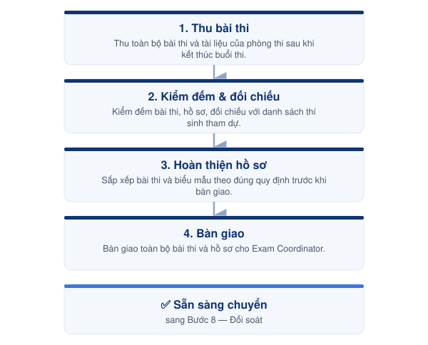

# 07-04. Quy trình Thu bài & Bàn giao



<h4 align="center">📅 Thời điểm</h4>

Ngay sau khi kết thúc từng buổi thi.




<h4 align="center">👤 Phụ trách</h4>

Invigilator




<h4 align="center">✅ Phê duyệt</h4>

Exam Coordinator




***

### 👥 Vai trò & Trách nhiệm

| Vai trò     | Trách nhiệm                                                            |
| ----------- | ---------------------------------------------------------------------- |
| Invigilator | Thu bài, kiểm đếm và bàn giao đầy đủ bài thi cùng hồ sơ của phòng thi. |

### 📋 Chuẩn bị

* 📄 Attendance List.
* 📄 Protokoll.
* 📄 Bài thi.
* 📄 Phiếu đánh giá (Speaking).
* 💾 USB ghi âm (Speaking).
* 📦 Túi đựng bài thi theo quy định.

***

### ⚠️ Quy tắc thực hiện


### Kiểm đếm

* Kiểm đếm toàn bộ bài thi và hồ sơ trước khi bàn giao.
* Đối chiếu với danh sách thí sinh tham dự.
* Báo ngay nếu phát hiện thiếu hoặc sai lệch.



### Bàn giao

* Chỉ bàn giao khi đã hoàn tất kiểm đếm.
* Hồ sơ của từng phòng thi phải được bàn giao riêng, không trộn lẫn.
* Không để bài thi ngoài phạm vi kiểm soát trong quá trình bàn giao.


***

<figure><figcaption>
Luồng thu bài &#x26; bàn giao
</figcaption></figure>

***

## 📖 Hướng dẫn thực hiện



### Thu bài thi

Thu toàn bộ bài thi và tài liệu của phòng thi sau khi kết thúc buổi thi.



### Kiểm đếm & đối chiếu

Kiểm đếm bài thi và hồ sơ, đối chiếu với danh sách thí sinh tham dự.



### Hoàn thiện hồ sơ

Sắp xếp bài thi và các biểu mẫu theo đúng quy định trước khi bàn giao.



### Bàn giao

Bàn giao toàn bộ bài thi và hồ sơ cho Exam Coordinator để tiếp tục quy trình đối soát.



***




### Checklist hoàn thành

* [ ] Đã thu đầy đủ bài thi.
* [ ] Đã kiểm đếm bài thi và hồ sơ.
* [ ] Đã đối chiếu với danh sách thí sinh.
* [ ] Đã hoàn tất bàn giao.





### Hoàn thành khi

* Toàn bộ bài thi và hồ sơ đã được bàn giao.
* Sẵn sàng chuyển sang **Bước 08. Đối soát bài thi & đề thi**.





### Lưu ý

* Quy trình này chỉ mô tả luồng thu bài và bàn giao.
* Hướng dẫn thao tác chi tiết được trình bày trong **Role Guide – Invigilator**.


***

## 📎 Tài liệu liên quan


[buoc-08-doi-soat](../buoc-08-doi-soat/)

