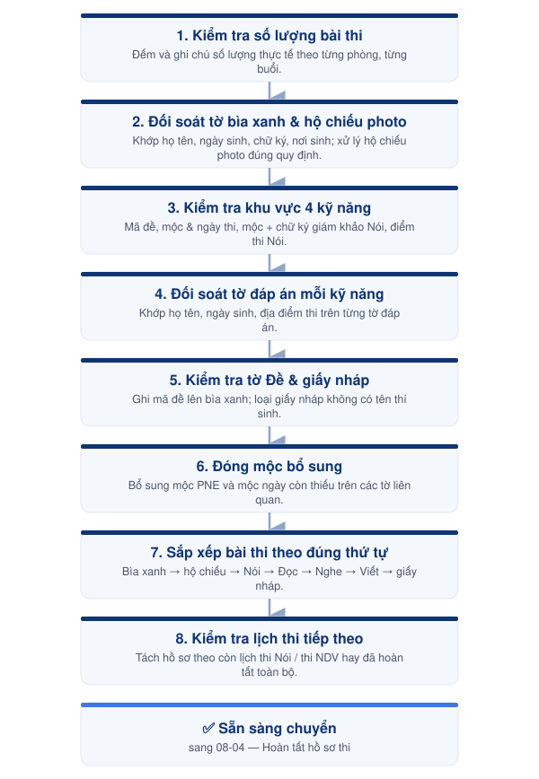

---
layout:
  width: wide
  title:
    visible: true
  description:
    visible: true
  tableOfContents:
    visible: true
  outline:
    visible: false
  pagination:
    visible: true
  metadata:
    visible: false
  tags:
    visible: true
  actions:
    visible: true
---

# 08-01. Đối soát bài thi Viết

Đối soát bài thi và hồ sơ của phần thi Viết nhằm đảm bảo đầy đủ, chính xác trước khi tiếp tục xử lý bài thi và đóng gói gửi ÖSD.



<h4 align="center">📅 Thời điểm</h4>

Sau khi nhận bài từ từng phòng thi Viết.




<h4 align="center">👤 Phụ trách</h4>

Exam Coordinator




<h4 align="center">✅ Phê duyệt</h4>

Exam Director




***

### 👥 Vai trò & Trách nhiệm

| Vai trò          | Trách nhiệm                                                           |
| ---------------- | --------------------------------------------------------------------- |
| Exam Coordinator | Kiểm đếm, đối soát bài thi, hồ sơ và đề thi của từng phòng thi Viết.  |
| Exam Director    | Hỗ trợ xác minh và phê duyệt các trường hợp sai lệch hoặc bất thường. |

### 📋 Chuẩn bị

* 📄 Bài thi và hồ sơ từ từng phòng thi (tờ bìa xanh, hộ chiếu photo, tờ đáp án, tờ đề, giấy nháp).
* 📄 Attendance List.
* 📄 Protokoll.
* 📄 Danh sách thí sinh theo đợt thi.
* 📄 3 tờ kết quả thi Nói (có mộc PNE, Giám khảo 1, Giám khảo 2).
* 📦 Đề thi còn dư.
* 🖊️ Bút bi, bút chì và mộc ngày/mộc nghiệp vụ để chỉnh sửa, ghi chú khi cần.

***

### ⚠️ Quy tắc thực hiện


### Phạm vi đối soát

* Thực hiện theo từng phòng thi và từng buổi thi.
* Hoàn tất đối soát của một phòng trước khi chuyển sang phòng tiếp theo.
* Không trộn bài thi hoặc hồ sơ giữa các phòng.



### Chữ ký & thông tin cá nhân

* Chữ ký trên tờ bìa xanh phải giống chữ ký trong hộ chiếu. Nếu không khớp, **không tự xử lý** — báo lại team để hẹn thí sinh lên đối chiếu.
* Họ, Tên, ngày tháng năm sinh trên tờ bìa xanh và hộ chiếu photo phải trùng khớp tuyệt đối.
* Nếu hộ chiếu không thể hiện nơi sinh, bắt buộc phải có Bị chú photo đính kèm.



### Điểm thi Nói

* Chỉ ghi nhận điểm đã được đóng mộc tên và chữ ký của **cả 2 Giám khảo** (Giám khảo 1 — dòng 1, Giám khảo 2 — dòng 2).
* Điểm trên tờ bìa xanh phải khớp với tờ Kết quả thi Nói chung (có mộc PNE). Nếu không trùng, **báo ngay chị Thanh** để giám khảo kiểm tra lại trước khi tiếp tục.
* Tích đúng ô **ja (đạt) / nein (không đạt)** theo đúng điểm thi.



### Bảo mật

* Bài thi và hồ sơ luôn nằm trong khu vực kiểm soát.
* Không tự ý chỉnh sửa hoặc bổ sung hồ sơ sau khi hoàn tất đối soát.


***

<figure><figcaption>
Luồng đối soát bài thi Viết
</figcaption></figure>

***

## 📖 Hướng dẫn thực hiện



### Kiểm tra số lượng bài thi

* Đếm và ghi chú số lượng bài thi thực tế so với danh sách đăng ký dự thi, theo từng phòng, từng buổi.
* Ví dụ cách ghi chú: _Sáng 13/01 — Nói: 20/20_, _Sáng 13/01 P11 NDV: 30/30_.



### Đối soát tờ bìa xanh & hộ chiếu photo

Kiểm tra trùng khớp các thông tin sau giữa tờ bìa xanh và hộ chiếu photo:

* **Họ:** HỌ · **Tên:** Tên lót + Tên.
* **Ngày tháng năm sinh:** DD/MM/YYYY.
* **Chữ ký:** đối chiếu với chữ ký trong hộ chiếu.
* **Nơi sinh** (trong hộ chiếu): nếu không có, cần kèm Bị chú photo.

Lưu ý xử lý hộ chiếu photo:

* Chỉ giữ lại trang thông tin cá nhân, trang có chữ ký và Bị chú (nếu có) — bỏ tờ bìa dư, bỏ kẹp ghim.
* Nếu hộ chiếu in ngang, xoay chiều hướng ra ngoài.



### Kiểm tra khu vực 4 kỹ năng thi (trên tờ bìa xanh)

* **Mã đề:** ghi chú bằng bút chì bên phải tên kỹ năng.
* **Đóng mộc và tích ô ngày thi** của từng kỹ năng.
* **Kỹ năng Nói:** phải có đầy đủ mộc tên của 2 Giám khảo theo đúng thứ tự (Giám khảo 1 — dòng 1, Giám khảo 2 — dòng 2) kèm chữ ký tương ứng.
* **Điểm thi Nói:** điền đầy đủ, khớp với tờ Kết quả thi Nói chung; tích đúng ô ja/nein theo điểm thi.



### Đối soát tờ đáp án mỗi kỹ năng

Kiểm tra trùng khớp các thông tin sau:

* **Họ tên:** đúng thứ tự HỌ, Tên lót + Tên. Nếu thí sinh viết sai thứ tự hoặc gộp chung, dùng bút bi vẽ mũi tên chỉnh lại đúng vị trí.
* **Ngày tháng năm sinh:** DD/MM/YYYY.
* **Địa điểm thi:** ghi đầy đủ _Phuong Nam Education, HCM-Stadt_ — không viết tắt (ví dụ không được viết "PNE").

Nếu thí sinh ghi sai hoặc thiếu thông tin trên, dùng bút bi điều chỉnh lại cho đúng.



### Kiểm tra tờ Đề & giấy nháp

* **Tờ Đề:** kiểm tra mã đề của từng kỹ năng để ghi chú lên tờ bìa xanh; điền mã đề vào file Danh sách thí sinh theo đợt thi.
* **Giấy nháp:** phải có tên thí sinh và mộc OSD. Nếu chỉ có mộc OSD mà không có tên, bỏ tờ nháp đó ra. Toàn bộ giấy nháp xếp ở cuối cùng, không cần theo thứ tự.



### Đóng mộc bổ sung

* **Mộc PNE** (tờ bìa xanh): nếu thiếu, đóng bổ sung ở góc trên bên trái.
* **Mộc ngày** (tờ đáp án, tờ bìa xanh, 3 tờ kết quả thi Nói): đóng theo đúng ngày của từng kỹ năng thi (mục _Datum_).



### Sắp xếp bài thi theo đúng thứ tự

1. Tờ bìa xanh.
2. Hộ chiếu photo.
3. Bị chú photo (nếu có).
4. Nói (Sprechen): 3 tờ kết quả, theo thứ tự có mộc PNE → Giám khảo 1 → Giám khảo 2.
5. Đọc (Lesen): Đề & Tờ đáp án.
6. Nghe (Hören): Đề & Tờ đáp án.
7. Viết (Schreiben): Đề & Tờ đáp án.
8. Nói (Sprechen): Đề.
9. Giấy nháp (tất cả các kỹ năng, không bắt buộc theo thứ tự).



### Kiểm tra lịch thi Nói buổi tiếp theo

Sau khi kiểm tra, đóng mộc và sắp xếp xong tập bài thi NDV (Nghe – Đọc – Viết), kiểm tra lại thí sinh có còn thi Nói ở buổi tiếp theo không:

* **Nếu thí sinh không còn lịch thi tiếp theo:** chuyển sang lưu trữ bài thi — phân loại bài thi theo từng thùng giấy, cất vào két sắt, kèm giấy ghi chú nếu cần.
* **Nếu thí sinh còn lịch thi Nói tiếp theo:** xếp tờ bìa xanh của bạn qua hồ sơ của phòng thi Nói, để hôm sau giám khảo note điểm lên bìa xanh.



### Kiểm tra danh sách thi Nói đã hoàn thành

Sau khi kiểm tra, đóng mộc và sắp xếp xong tập bài thi Nói, kiểm tra lại thí sinh có còn thi các kỹ năng còn lại ở buổi tiếp theo không:

* **Nếu còn thi Nghe – Đọc – Viết:** để riêng tập bài thi, chuẩn bị thêm tờ bìa trắng đưa cho Giám thị để các bạn thi sau đó. Sau buổi thi các kỹ năng còn lại, sắp xếp bài thi từ tờ bìa trắng vào tập bài thi bìa xanh theo đúng thứ tự ở bước 7.
* **Nếu thí sinh bỏ thi Nói:** chuẩn bị tờ bìa xanh cho các kỹ năng còn lại như bình thường.



***




### Checklist hoàn thành

* [ ] Đã kiểm tra số lượng bài thi theo từng phòng, từng buổi.
* [ ] Đã đối soát tờ bìa xanh & hộ chiếu photo.
* [ ] Đã kiểm tra khu vực 4 kỹ năng thi (mã đề, mộc, điểm Nói).
* [ ] Đã đối soát tờ đáp án từng kỹ năng.
* [ ] Đã kiểm tra tờ Đề & giấy nháp.
* [ ] Đã đóng mộc bổ sung (nếu thiếu).
* [ ] Đã sắp xếp bài thi theo đúng thứ tự quy định.
* [ ] Đã kiểm tra lịch thi Nói / các kỹ năng còn lại của buổi tiếp theo.





### Hoàn thành khi

* Toàn bộ bài thi Viết đã được đối soát và sắp xếp đúng thứ tự.
* Hồ sơ đầy đủ, không còn sai lệch chưa xử lý (chữ ký, điểm Nói, thông tin cá nhân).
* Sẵn sàng chuyển sang các bước xử lý tiếp theo.





### Lưu ý

* Đối với thí sinh còn lịch thi ở buổi hoặc ngày tiếp theo, cần tách riêng hồ sơ (kèm tờ bìa trắng nếu cần) để tiếp tục sử dụng trong các buổi thi sau.
* Mọi sai lệch về chữ ký hoặc điểm thi Nói phải được báo cáo và xác minh trước khi tiếp tục — không tự ý xử lý.
* Chỉ chuyển bài thi sang bước tiếp theo sau khi đã hoàn tất toàn bộ nội dung đối soát.


***

## 📎 Tài liệu liên quan


[08-02-doi-soat-bai-thi-noi.md](08-02-doi-soat-bai-thi-noi.md)



[08-03-quan-ly-bai-thi-nhan-ket-qua-nhanh.md](08-03-quan-ly-bai-thi-nhan-ket-qua-nhanh.md)

