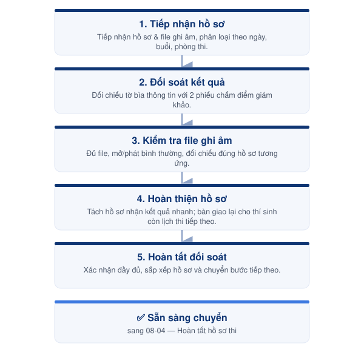

# 08-02. Đối soát bài thi Nói



<h4 align="center">📅 Thời điểm</h4>

Sau khi kết thúc phần thi Nói của từng buổi thi hoặc sau ngày thi cuối cùng (đối với kỳ thi diễn ra nhiều ngày).




<h4 align="center">👤 Phụ trách</h4>

Exam Coordinator




<h4 align="center">✅ Phê duyệt</h4>

Exam Director




***

### 👥 Vai trò & Trách nhiệm

| Vai trò          | Trách nhiệm                                              |
| ---------------- | -------------------------------------------------------- |
| Exam Coordinator | Đối soát kết quả, hồ sơ và file ghi âm của phần thi Nói. |
| Exam Director    | Hỗ trợ xử lý và phê duyệt các trường hợp phát sinh.      |

### 📋 Chuẩn bị

* 📄 Hồ sơ phần thi Nói.
* 📄 Tờ bìa thông tin thí sinh.
* 📄 Phiếu chấm điểm của 02 giám khảo.
* 📄 Phiếu chấm điểm chung.
* 📄 Protokoll.
* 💾 File ghi âm phần thi Nói.
* 💻 Máy tính phục vụ đối soát.

***

### ⚠️ Quy tắc thực hiện


### Đối soát hồ sơ

* Thực hiện đối soát theo từng phòng thi và từng buổi thi.
* Hoàn tất đối soát của một phòng trước khi chuyển sang phòng tiếp theo.
* Không trộn hồ sơ giữa các phòng thi.



### Kết quả phần thi Nói

* Chỉ sử dụng kết quả đã được **02 giám khảo** thống nhất và xác nhận.
* Điểm tổng trên **tờ bìa thông tin** phải trùng khớp với điểm tổng trên **phiếu chấm điểm chung**.
* Kiểm tra đầy đủ thông tin trên cả 02 phiếu chấm điểm:
  * Đúng tên thí sinh.
  * Đúng họ tên giám khảo.
  * Đúng chữ ký của giám khảo (nếu có yêu cầu).
* Nếu phát hiện sai lệch, **dừng việc đối soát** và báo ngay **Exam Director** để phối hợp với giám khảo xử lý trước khi tiếp tục.



### File ghi âm

* File ghi âm phải đầy đủ theo từng phòng thi.
* File ghi âm phải đúng với hồ sơ của từng thí sinh.
* Không chỉnh sửa, đổi tên hoặc ghi đè file sau khi hoàn tất đối soát.


***

<figure><figcaption>
Luồng đối soát bài thi Nói
</figcaption></figure>

***

## 📖 Hướng dẫn thực hiện



### Tiếp nhận hồ sơ

* Tiếp nhận hồ sơ và file ghi âm từ từng phòng thi.
* Phân loại theo ngày thi, buổi thi và phòng thi.



### Đối soát kết quả

* Đối chiếu tờ bìa thông tin với phiếu chấm điểm chung.
* Kiểm tra 02 phiếu chấm điểm của giám khảo.
* Xác nhận kết quả phần thi Nói đã đầy đủ và thống nhất.



### Kiểm tra file ghi âm

* Kiểm tra đầy đủ file ghi âm của từng phòng thi.
* Đảm bảo file ghi âm có thể mở và phát bình thường.
* Đối chiếu file ghi âm với hồ sơ tương ứng.



### Hoàn thiện hồ sơ

* Hoàn thiện hồ sơ của từng thí sinh.
* Đối với thí sinh đăng ký **nhận kết quả nhanh**, tách riêng hồ sơ để chuyển sang quy trình **03. Quản lý bài thi nhận kết quả nhanh**.
* Đối với thí sinh còn lịch thi ở ngày tiếp theo, bàn giao lại **tờ bìa thông tin** kèm hồ sơ cho giám thị để tiếp tục ghi nhận kết quả phần thi Nói.

Kiểm tra lịch thi tiếp theo của thí sinh để xử lý theo 1 trong 2 trường hợp:

* **Nếu thí sinh không còn lịch thi tiếp theo:** chuyển sang lưu trữ bài thi — phân loại bài thi theo từng thùng giấy, cất vào két sắt, kèm giấy ghi chú nếu cần.
* **Nếu thí sinh còn lịch thi Đọc – Nghe – Viết tiếp theo:** chuẩn bị tờ bìa thông tin để đưa cho giám thị ở phòng thi của bạn cho lịch thi tiếp theo.



### Hoàn tất đối soát

* Xác nhận toàn bộ hồ sơ phần thi Nói đã đầy đủ.
* Sắp xếp hồ sơ theo đúng quy định.
* Chuyển sang bước xử lý tiếp theo.



***




### Checklist hoàn thành

* [ ] Đã tiếp nhận đầy đủ hồ sơ.
* [ ] Đã đối soát kết quả phần thi Nói.
* [ ] Đã kiểm tra file ghi âm.
* [ ] Đã hoàn thiện hồ sơ của từng thí sinh.
* [ ] Đã xử lý lưu trữ hoặc bàn giao hồ sơ theo đúng lịch thi tiếp theo của thí sinh.
* [ ] Không còn sai lệch chưa xử lý.





### Hoàn thành khi

* Hồ sơ, kết quả và file ghi âm của phần thi Nói đã được đối soát đầy đủ.
* Sẵn sàng chuyển sang **03. Quản lý bài thi nhận kết quả nhanh** hoặc **04. Hoàn tất hồ sơ sau ngày thi cuối**.





### Lưu ý

* Chỉ tách riêng hồ sơ đối với thí sinh đăng ký **nhận kết quả nhanh**.
* Đối với thí sinh còn lịch thi ở ngày tiếp theo, tiếp tục sử dụng cùng **tờ bìa thông tin** để ghi nhận kết quả phần thi Nói.
* Chỉ chuyển hồ sơ sang bước tiếp theo sau khi đã hoàn tất toàn bộ nội dung đối soát.


***

## 📎 Tài liệu liên quan


[08-03-quan-ly-bai-thi-nhan-ket-qua-nhanh.md](08-03-quan-ly-bai-thi-nhan-ket-qua-nhanh.md)



[08-04-dong-goi-va-luu-tru-bai-thi.md](08-04-dong-goi-va-luu-tru-bai-thi.md)

