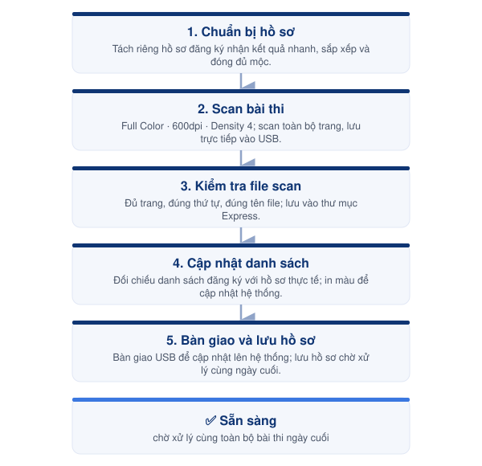

# 08-03. Quản lý bài thi nhận kết quả nhanh



<h4 align="center">📅 Thời điểm</h4>

Sau khi các thí sinh nhận kết quả nhanh đã hoàn tất thi.




<h4 align="center">👤 Phụ trách</h4>

Exam Coordinator




<h4 align="center">✅ Phê duyệt</h4>

Exam Director




***

### 👥 Vai trò & Trách nhiệm

| Vai trò          | Trách nhiệm                                                        |
| ---------------- | ------------------------------------------------------------------ |
| Exam Coordinator | Chuẩn bị hồ sơ, scan bài thi và bàn giao để cập nhật lên hệ thống. |
| Exam Director    | Hỗ trợ xử lý các trường hợp phát sinh (nếu có).                    |

### 📋 Chuẩn bị

* 📄 Hồ sơ của thí sinh đăng ký nhận kết quả nhanh.
* 💾 USB lưu file scan.
* 🖨️ Máy scan.
* 📄 Danh sách thí sinh đăng ký nhận kết quả nhanh.
* 📁 Bìa lưu hồ sơ.

***

### ⚠️ Quy tắc thực hiện


### Ưu tiên xử lý

* Hồ sơ nhận kết quả nhanh được ưu tiên xử lý trước các hồ sơ còn lại.
* Chỉ thực hiện sau khi đã hoàn tất đối soát bài thi.



### File scan

* Scan đầy đủ toàn bộ bài thi.
* Kiểm tra file scan trước khi bàn giao.
* Không chỉnh sửa nội dung hoặc thứ tự trang sau khi lưu file.



### Đặt tên file

* Lưu theo cấu trúc:

`<Trình độ> - <HỌ TÊN THÍ SINH>`

Ví dụ:

`B1 - NGUYEN VAN A`

* Lưu đúng vào thư mục **Express** trong USB.


***

<figure><figcaption>
Luồng quản lý bài thi nhận kết quả nhanh
</figcaption></figure>

***

## 📖 Hướng dẫn thực hiện



### Chuẩn bị hồ sơ

* Tách riêng hồ sơ của các thí sinh đăng ký nhận kết quả nhanh.
* Kiểm tra thông tin, sắp xếp bài thi đúng thứ tự.
* Đóng đầy đủ các dấu mộc theo quy định.



### Scan bài thi

Thiết lập máy scan:

* Full Color
* 600 dpi
* Density: Mức 4

Thực hiện scan:

* Preview trang bìa.
* Bắt đầu scan.
* Tiếp tục scan toàn bộ các trang.
* Lưu file trực tiếp vào USB.



### Kiểm tra file scan

* Đối chiếu số lượng trang với bài thi giấy.
* Kiểm tra đúng thứ tự các trang.
* Kiểm tra chất lượng hình ảnh.
* Đặt tên file theo đúng quy định.
* Lưu vào thư mục **Express** trong USB.



### Cập nhật danh sách

* Kiểm tra danh sách thí sinh đăng ký nhận kết quả nhanh theo từng trình độ.
* Đối chiếu với hồ sơ thực tế.
* In màu danh sách để phục vụ cập nhật lên hệ thống.



### Bàn giao và lưu hồ sơ

* Bàn giao USB cho người phụ trách cập nhật bài thi lên Tool.
* Sau khi hoàn tất cập nhật, sắp xếp bài thi vào bìa lưu hồ sơ.
* Đính kèm giấy ghi chú nhận kết quả nhanh.
* Lưu riêng hồ sơ và chờ xử lý cùng toàn bộ bài thi vào ngày thi cuối cùng.



***




### Checklist hoàn thành

* [ ] Hồ sơ đã được chuẩn bị.
* [ ] Bài thi đã được scan.
* [ ] File scan đã được kiểm tra.
* [ ] File đã được lưu đúng quy định.
* [ ] Đã bàn giao để cập nhật lên Tool.
* [ ] Hồ sơ đã được lưu riêng.





### Hoàn thành khi

* Toàn bộ bài thi nhận kết quả nhanh đã được cập nhật lên Tool.
* Hồ sơ đã được lưu riêng và sẵn sàng cho bước **04. Hoàn tất hồ sơ sau ngày thi cuối**.





### Lưu ý

* Chỉ áp dụng đối với thí sinh đăng ký **nhận kết quả nhanh**.
* Không xử lý chung với các bài thi thông thường.
* Hồ sơ được lưu riêng cho đến ngày thi cuối cùng trước khi đóng gói gửi ÖSD.


***

## 📎 Tài liệu liên quan


[08-04.-hoan-tat-ho-so-sau-ngay-thi-cuoi.md](../../quy-trinh-to-chuc-thi-osd/buoc-08-doi-soat/08-04.-hoan-tat-ho-so-sau-ngay-thi-cuoi.md)

