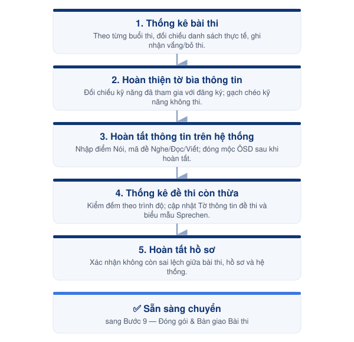

---
layout:
  width: wide
  title:
    visible: true
  description:
    visible: true
  tableOfContents:
    visible: true
  outline:
    visible: false
  pagination:
    visible: true
  metadata:
    visible: false
  tags:
    visible: true
  actions:
    visible: true
---

# 08-04. Hoàn tất hồ sơ thi

Hoàn tất hồ sơ kỳ thi, đảm bảo toàn bộ bài thi, đề thi và thông tin trên hệ thống đã được kiểm tra đầy đủ trước khi chuyển sang bước **Đóng gói & Bàn giao bài thi**.



#### 📅 Thời điểm

Sau khi kết thúc ngày thi cuối cùng.



#### 👤 Phụ trách

Exam Coordinator



#### ✅ Phê duyệt

Exam Director



***

### 👥 Vai trò & Trách nhiệm

| Vai trò | Trách nhiệm |
| --- | --- |
| Exam Coordinator | Hoàn tất hồ sơ, thống kê bài thi và đề thi trước khi bàn giao. |
| Exam Director | Kiểm tra và xác nhận các trường hợp phát sinh (nếu có). |

### 📋 Chuẩn bị

- 📄 Toàn bộ bài thi của kỳ thi.
- 📄 Danh sách thí sinh thực tế.
- 📄 Tờ bìa thông tin.
- 📄 Tờ thông tin đề thi.
- 💻 Hệ thống quản lý bài thi.

***

### ⚠️ Quy tắc thực hiện


### Tờ bìa thông tin

- Chỉ cập nhật sau khi đã đối chiếu với **Danh sách thí sinh thực tế**.
- Đối với các kỹ năng thí sinh **không tham gia thi**, gạch chéo thông tin kỹ năng trên tờ bìa bằng **bút mực xanh**.
- Không chỉnh sửa khi chưa xác minh đầy đủ thông tin.



### Nhập thông tin bài thi

- Chỉ nhập thông tin sau khi đã hoàn tất đối soát.
- Kiểm tra đầy đủ trước khi xác nhận trên hệ thống.
- Sau khi hoàn tất nhập liệu, đóng mộc ÖSD trên tờ bìa thông tin.



### Thống kê đề thi

- Kiểm đếm toàn bộ đề thi còn thừa theo từng trình độ.
- Ghi nhận đầy đủ trên Tờ thông tin đề thi.
- Đối với **Einzelbewertung Sprechen** và **Bewertungsbögen Sprechen**, có thể phân bổ số lượng còn dư vào 01 hoặc 02 mã đề do các biểu mẫu này không khác nhau giữa các mã đề, nhưng không vượt quá số lượng tối đa được ghi trên Tờ thông tin đề thi.


***

<figure><figcaption>
Luồng hoàn tất hồ sơ thi
</figcaption></figure>

***

## 📖 Hướng dẫn thực hiện




### Thống kê bài thi

- Thống kê bài thi của từng buổi thi (Sáng và Chiều).
- Đối chiếu với danh sách thí sinh thực tế.
- Kiểm tra các trường hợp vắng thi hoặc bỏ thi.



### Hoàn thiện tờ bìa thông tin

- Kiểm tra các kỹ năng thí sinh thực tế đã tham gia.
- Đối chiếu với danh sách đăng ký.
- Đối với các kỹ năng không tham gia thi, gạch chéo trên tờ bìa bằng bút mực xanh.



### Hoàn tất thông tin trên hệ thống

- Hỗ trợ nhập điểm phần thi Nói.
- Nhập mã đề của phần thi Nghe, Đọc và Viết.
- Sau khi hoàn tất nhập liệu, đóng mộc ÖSD tại góc trên bên phải của tờ bìa thông tin.



### Thống kê đề thi còn thừa

- Kiểm đếm số lượng đề thi còn thừa theo từng trình độ.
- Cập nhật vào Tờ thông tin đề thi.
- Thực hiện thống kê các biểu mẫu **Einzelbewertung Sprechen** và **Bewertungsbögen Sprechen** theo quy định.



### Hoàn tất hồ sơ

- Kiểm tra lại toàn bộ hồ sơ của kỳ thi.
- Xác nhận không còn sai lệch giữa bài thi, hồ sơ và hệ thống.
- Chuyển toàn bộ hồ sơ sang **Bước 9 — Đóng gói & Bàn giao bài thi**.




***




### Checklist hoàn thành

- [ ] Đã thống kê đầy đủ bài thi.
- [ ] Đã cập nhật tờ bìa thông tin.
- [ ] Đã nhập đầy đủ thông tin bài thi.
- [ ] Đã đóng mộc ÖSD.
- [ ] Đã thống kê đề thi còn thừa.
- [ ] Hồ sơ sẵn sàng chuyển sang Bước 9.





### Hoàn thành khi

- Hồ sơ kỳ thi đã được hoàn tất.
- Thông tin trên hệ thống khớp với hồ sơ thực tế.
- Sẵn sàng thực hiện **Bước 9 — Đóng gói & Bàn giao bài thi**.





### Lưu ý

- Chỉ thực hiện sau ngày thi cuối cùng.
- Mọi điều chỉnh trên tờ bìa thông tin phải được kiểm tra với danh sách thí sinh thực tế.
- Không chuyển sang Bước 9 khi vẫn còn sai lệch giữa hồ sơ giấy và dữ liệu trên hệ thống.


***

## 📎 Tài liệu liên quan


[buoc-09-dong-goi-ban-giao.md](../buoc-09-dong-goi-ban-giao.md)

