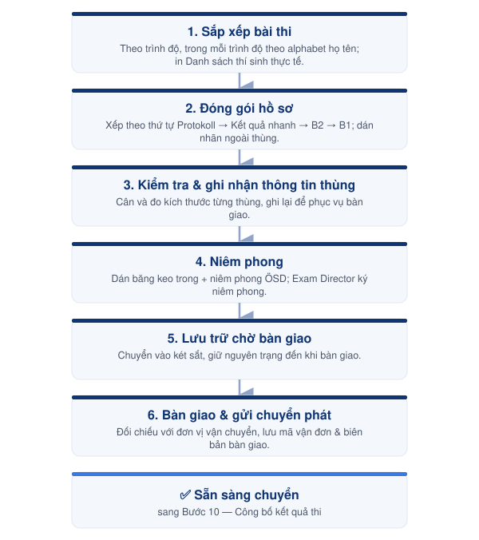

# Bước 9 — Đóng gói & Bàn giao Bài thi



#### 📅 Thời điểm

Sau khi hoàn tất toàn bộ hồ sơ của kỳ thi (Bước 8).



#### 👤 Phụ trách

Exam Coordinator



#### ✅ Phê duyệt

Exam Director



***

### 👥 Vai trò & Trách nhiệm

| Vai trò          | Trách nhiệm                                                                              |
| ---------------- | ---------------------------------------------------------------------------------------- |
| Exam Coordinator | Sắp xếp, đóng gói, niêm phong, lưu trữ và liên hệ đơn vị vận chuyển để bàn giao bài thi. |
| Exam Director    | Kiểm tra, ký niêm phong các thùng bài thi và phê duyệt trước khi bàn giao.               |

### 📋 Chuẩn bị

* 📦 Thùng carton đóng gói.
* 📏 Thước dây.
* ⚖️ Cân điện tử.
* ✂️ Kéo.
* 📌 Băng keo trong (cuộn lớn).
* 📌 Băng keo niêm phong ÖSD.
* 🖊️ Bút lông.
* 🏷️ Nhãn dán thùng (tên kỳ thi, ngày thi, trình độ, số lượng thí sinh).
* 📄 Danh sách thí sinh thực tế.
* 📄 Protokoll.
* 📄 Toàn bộ bài thi đã hoàn tất đối soát (Bước 8).
* 📄 Biên bản bàn giao / phiếu gửi hàng.

***

### ⚠️ Quy tắc thực hiện


### Điều kiện bắt buộc trước khi đóng gói

* Chỉ đóng gói sau khi toàn bộ hồ sơ đã hoàn tất đối soát ở **Bước 8** và không còn sai lệch chưa xử lý.
* Đối chiếu lại số lượng bài thi thực tế với **Danh sách thí sinh thực tế** trước khi xếp vào thùng.



### Sắp xếp & đóng gói

* Sắp xếp bài thi theo từng trình độ; trong mỗi trình độ, sắp xếp theo thứ tự alphabet họ tên thí sinh.
* Không trộn bài thi của các trình độ khác nhau trong cùng một thùng nếu không có hướng dẫn riêng từ ÖSD.
* Dán nhãn bên ngoài mỗi thùng: tên kỳ thi, ngày thi, trình độ, số lượng thí sinh — để dễ đối chiếu khi bàn giao.



### Niêm phong

* Chỉ niêm phong khi toàn bộ hồ sơ trong thùng đã được kiểm tra và Exam Director xác nhận.
* Sau khi niêm phong, **không mở lại** nếu chưa có sự phê duyệt của Exam Director; mọi lần mở lại phải được ghi chú rõ lý do.



### Bàn giao vận chuyển

* Chỉ bàn giao cho đơn vị vận chuyển đã được ÖSD chỉ định/đăng ký.
* Đối chiếu số lượng, cân nặng và kích thước từng thùng với đơn vị vận chuyển trước khi ký biên bản bàn giao.
* Lưu lại mã vận đơn (tracking number) và biên bản bàn giao để theo dõi và đối chiếu khi cần.


***

<figure><figcaption>
Luồng đóng gói &#x26; bàn giao bài thi
</figcaption></figure>

***

## 📖 Hướng dẫn thực hiện



### Sắp xếp bài thi

* Sắp xếp bài thi theo từng trình độ.
* Trong mỗi trình độ, sắp xếp theo thứ tự alphabet họ tên thí sinh.
* In **Danh sách thí sinh thực tế** của kỳ thi để kèm theo hồ sơ.



### Đóng gói hồ sơ

Xếp hồ sơ vào thùng theo thứ tự:

1. Protokoll
2. Hồ sơ nhận kết quả nhanh
3. B2
4. B1

(Nếu có nhiều trình độ khác, thực hiện theo hướng dẫn của ÖSD.)

Dán nhãn bên ngoài thùng: tên kỳ thi, ngày thi, trình độ, số lượng thí sinh.



### Kiểm tra và ghi nhận thông tin thùng

* Cân từng thùng bài thi.
* Đo kích thước của từng thùng.
* Ghi lại cân nặng và kích thước để phục vụ bàn giao.



### Niêm phong

* Dán băng keo trong để cố định thùng.
* Dán băng keo niêm phong ÖSD.
* Exam Director ký niêm phong trên các mặt của thùng theo quy định.



### Lưu trữ chờ bàn giao

* Chuyển các thùng bài thi vào két sắt.
* Lưu giữ nguyên trạng cho đến khi thực hiện bàn giao cho đơn vị vận chuyển.



### Bàn giao & gửi chuyển phát

* Liên hệ đơn vị vận chuyển (theo thông tin ÖSD đã đăng ký) để hẹn lịch đến nhận thùng.
* Đối chiếu số lượng, cân nặng và kích thước từng thùng với đơn vị vận chuyển trước khi ký biên bản bàn giao.
* Nhận và lưu lại mã vận đơn (tracking number), biên bản bàn giao.
* Theo dõi lộ trình vận chuyển đến khi ÖSD xác nhận đã nhận hàng; xử lý phát sinh (chậm, thất lạc) theo [Danh mục rủi ro & phương án xử lý](../05-risk-management/risk-register.md) nếu có.



***




### Checklist hoàn thành

* [ ] Đã sắp xếp bài thi theo đúng thứ tự.
* [ ] Đã in danh sách thí sinh thực tế.
* [ ] Đã đóng gói đầy đủ hồ sơ và dán nhãn thùng.
* [ ] Đã ghi nhận cân nặng và kích thước thùng.
* [ ] Đã niêm phong thùng bài thi.
* [ ] Đã lưu toàn bộ thùng bài thi vào két sắt.
* [ ] Đã bàn giao cho đơn vị vận chuyển và lưu mã vận đơn.





### Hoàn thành khi

* Toàn bộ bài thi đã được đóng gói, niêm phong và bàn giao cho đơn vị vận chuyển.
* Có mã vận đơn và biên bản bàn giao lưu trữ đầy đủ.
* Sẵn sàng chuyển sang **Bước 10 — Công bố kết quả thi**.





### Lưu ý

* Kiểm tra kỹ hồ sơ trước khi đóng thùng.
* Không niêm phong khi vẫn còn sai lệch chưa được xử lý.
* Sau khi niêm phong, chỉ mở thùng khi có sự phê duyệt của Exam Director.
* Nếu lô hàng chậm hoặc thất lạc trong vận chuyển, xem [Danh mục rủi ro & phương án xử lý](../05-risk-management/risk-register.md).


***

## 📎 Tài liệu liên quan


[buoc-08-doi-soat](buoc-08-doi-soat/)



[buoc-10-cong-bo-ket-qua.md](buoc-10-cong-bo-ket-qua.md)

