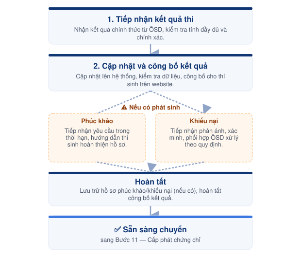

# Bước 10 — Công bố kết quả thi



#### 📅 Thời điểm

Khoảng 4–6 tuần sau kỳ thi hoặc theo thông báo chính thức của ÖSD.



#### 👤 Phụ trách

Exam Coordinator



#### ✅ Phê duyệt

Exam Director



***

### 👥 Vai trò & Trách nhiệm

<table><thead><tr><th width="261.46875">Vai trò</th><th>Trách nhiệm</th></tr></thead><tbody><tr><td>Exam Coordinator</td><td>Tiếp nhận kết quả thi, cập nhật hệ thống, công bố kết quả và tiếp nhận các yêu cầu của thí sinh.</td></tr><tr><td>Exam Director</td><td>Phê duyệt và hỗ trợ xử lý các trường hợp phát sinh hoặc khiếu nại.</td></tr></tbody></table>

### 📋 Chuẩn bị

* 📄 Kết quả thi chính thức do ÖSD cung cấp.
* 💻 Hệ thống quản lý kỳ thi.
* 🌐 Website tra cứu kết quả.
* 📄 Danh sách thí sinh.
* 📄 Quy định phúc khảo của ÖSD (nếu có).

***

### ⚠️ Quy tắc thực hiện


### Công bố kết quả

* Chỉ công bố kết quả sau khi nhận được kết quả chính thức từ ÖSD.
* Chỉ sử dụng dữ liệu do ÖSD cung cấp.
* Không tự ý chỉnh sửa hoặc thay đổi kết quả thi dưới bất kỳ hình thức nào.



### Cập nhật hệ thống

* Kiểm tra tính đầy đủ của dữ liệu trước khi cập nhật.
* Chỉ công bố kết quả sau khi hoàn tất việc cập nhật và kiểm tra trên hệ thống.
* Thực hiện theo đúng quy trình của **Hệ thống quản lý kỳ thi**.



### Phúc khảo & Khiếu nại

* Chỉ tiếp nhận yêu cầu trong thời hạn theo quy định của ÖSD.
* Hướng dẫn thí sinh đúng quy trình và biểu mẫu.
* Không tự ý cam kết thay đổi kết quả thi.


***

<figure><figcaption>
Luồng công bố kết quả &#x26; xử lý phúc khảo/khiếu nại
</figcaption></figure>

***

## 📖 Hướng dẫn thực hiện



### Tiếp nhận kết quả thi

* Tiếp nhận kết quả thi chính thức từ ÖSD.
* Kiểm tra tính đầy đủ và chính xác của dữ liệu.
* Lưu trữ kết quả theo quy định.



### Cập nhật và công bố kết quả

* Cập nhật kết quả lên hệ thống quản lý kỳ thi.
* Kiểm tra dữ liệu sau khi cập nhật.
* Công bố kết quả cho thí sinh trên website.

> Chi tiết thao tác trên hệ thống được hướng dẫn tại **Hệ thống quản lý kỳ thi → Quy trình công bố kết quả thi**.



### Tiếp nhận yêu cầu phúc khảo

* Tiếp nhận yêu cầu phúc khảo của thí sinh (nếu có).
* Kiểm tra điều kiện và thời hạn tiếp nhận.
* Hướng dẫn thí sinh hoàn thiện hồ sơ theo quy định của ÖSD.



### Xử lý khiếu nại

* Tiếp nhận các phản ánh liên quan đến kết quả thi.
* Xác minh thông tin.
* Phối hợp với ÖSD để xử lý theo quy định (nếu cần).



### Hoàn tất

* Lưu trữ hồ sơ phúc khảo và khiếu nại (nếu có).
* Hoàn tất việc công bố kết quả của kỳ thi.
* Chuyển sang **Bước 11 — Cấp phát chứng chỉ**.



***




### Checklist hoàn thành

* [ ] Đã tiếp nhận kết quả từ ÖSD.
* [ ] Đã cập nhật kết quả lên hệ thống.
* [ ] Đã kiểm tra dữ liệu sau khi cập nhật.
* [ ] Đã công bố kết quả trên website.
* [ ] Đã tiếp nhận và xử lý các yêu cầu phúc khảo (nếu có).
* [ ] Đã lưu trữ đầy đủ hồ sơ liên quan.





### Hoàn thành khi

* Kết quả thi đã được công bố trên website.
* Các yêu cầu phúc khảo và khiếu nại (nếu có) đã được tiếp nhận theo đúng quy định.
* Sẵn sàng chuyển sang **Bước 11 — Cấp phát chứng chỉ**.





### Lưu ý

* Không công bố kết quả trước khi nhận thông báo chính thức từ ÖSD.
* Các thao tác trên website không được mô tả trong Operation Handbook.
* Thực hiện theo tài liệu **Hệ thống quản lý kỳ thi → Quy trình công bố kết quả thi**.
* Lưu trữ đầy đủ hồ sơ và lịch sử trao đổi đối với các trường hợp phúc khảo hoặc khiếu nại.


***

## 📎 Tài liệu liên quan

> **Hệ thống quản lý kỳ thi → Quy trình công bố kết quả thi** _(Sẽ bổ sung sau khi hoàn thiện tài liệu Hệ thống quản lý kỳ thi.)_


[buoc-09-dong-goi-ban-giao.md](buoc-09-dong-goi-ban-giao.md)



[buoc-11-cap-phat-chung-chi.md](buoc-11-cap-phat-chung-chi.md)

