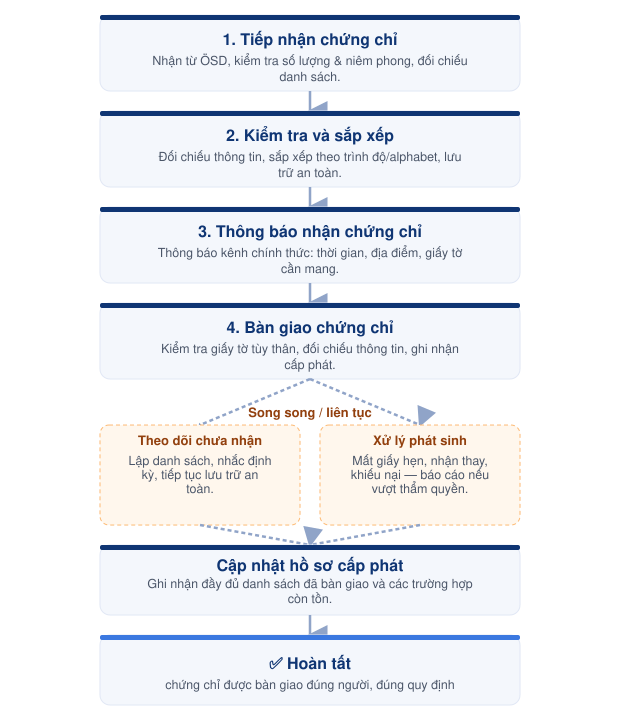

# Bước 11 — Cấp phát chứng chỉ



#### 📅 Thời điểm

Khoảng 2 tuần sau khi công bố kết quả thi hoặc theo lịch gửi chứng chỉ của ÖSD.



#### 👤 Phụ trách

Exam Operations Team

Phối hợp: Exam Coordinator



#### ✅ Phê duyệt

Exam Director



***

### 👥 Vai trò & Trách nhiệm

| Vai trò              | Trách nhiệm                                                      |
| -------------------- | ---------------------------------------------------------------- |
| Exam Operations Team | Tiếp nhận, kiểm tra, lưu trữ và bàn giao chứng chỉ cho thí sinh. |
| Exam Coordinator     | Phối hợp xử lý các trường hợp phát sinh.                         |
| Exam Director        | Phê duyệt phương án xử lý các trường hợp vượt thẩm quyền.        |

### 📋 Chuẩn bị

* 📄 Danh sách chứng chỉ được ÖSD gửi.
* 📄 Danh sách thí sinh đủ điều kiện nhận chứng chỉ.
* 📄 Biểu mẫu bàn giao chứng chỉ (nếu áp dụng).
* 🏫 Khu vực lưu trữ chứng chỉ an toàn.

***

### ⚠️ Quy tắc thực hiện


### Tiếp nhận & bảo quản

* Kiểm tra số lượng, tình trạng niêm phong ngay khi tiếp nhận, đối chiếu với danh sách đi kèm.
* Báo ngay cho Exam Coordinator nếu phát hiện thiếu, sai hoặc hư hỏng.
* Chứng chỉ luôn được lưu trữ tại khu vực bảo quản được chỉ định.



### Bàn giao

* Chỉ bàn giao sau khi đã kiểm tra giấy tờ tùy thân và đối chiếu thông tin người nhận.
* Không bàn giao cho người không đúng thông tin hoặc không đủ điều kiện nhận thay.


***

<figure><figcaption>
Luồng cấp phát chứng chỉ
</figcaption></figure>

***

## 📖 Hướng dẫn thực hiện



### Tiếp nhận chứng chỉ

* Nhận chứng chỉ được gửi từ ÖSD qua đơn vị vận chuyển.
* Kiểm tra số lượng, tình trạng niêm phong và đối chiếu với danh sách đi kèm.
* Báo ngay cho Exam Coordinator nếu phát hiện thiếu, sai hoặc hư hỏng.



### Kiểm tra và sắp xếp

* Đối chiếu thông tin trên chứng chỉ với danh sách thí sinh.
* Sắp xếp chứng chỉ theo trình độ hoặc theo thứ tự alphabet để thuận tiện tra cứu và cấp phát.
* Lưu trữ tại khu vực bảo quản được chỉ định.



### Thông báo nhận chứng chỉ

* Thông báo cho thí sinh qua các kênh liên lạc chính thức.
* Hướng dẫn thời gian, địa điểm và giấy tờ cần mang theo khi nhận chứng chỉ.



### Bàn giao chứng chỉ

* Kiểm tra giấy tờ tùy thân của người nhận.
* Đối chiếu thông tin trước khi bàn giao.
* Ghi nhận việc đã cấp phát theo quy định.



### Theo dõi chứng chỉ chưa nhận

* Lập danh sách các chứng chỉ chưa được nhận.
* Chủ động nhắc lại thí sinh theo định kỳ.
* Tiếp tục lưu trữ an toàn cho đến khi hoàn tất bàn giao.



### Xử lý phát sinh

* Tiếp nhận và xử lý các trường hợp mất giấy hẹn, nhận thay hoặc khiếu nại theo quy định hiện hành.
* Báo cáo Exam Coordinator đối với các trường hợp vượt thẩm quyền.



***




### Checklist hoàn thành

* [ ] Toàn bộ chứng chỉ đã được kiểm đếm và lưu trữ an toàn.
* [ ] Đã thông báo và bàn giao chứng chỉ cho thí sinh.
* [ ] Đã cập nhật danh sách cấp phát.
* [ ] Đã lập danh sách và theo dõi chứng chỉ chưa nhận.





### Hoàn thành khi

* Chứng chỉ được bàn giao đúng người nhận.
* Danh sách cấp phát được cập nhật đầy đủ.
* Các chứng chỉ chưa nhận được theo dõi và quản lý riêng.





### Lưu ý

Báo ngay cho Exam Coordinator khi phát sinh các trường hợp sau:

* Thiếu hoặc thất lạc chứng chỉ.
* Sai thông tin trên chứng chỉ.
* Thí sinh khiếu nại liên quan đến chứng chỉ.
* Người nhận không đúng thông tin hoặc không đủ điều kiện nhận thay.


***

## 📎 Tài liệu liên quan


[buoc-10-cong-bo-ket-qua.md](buoc-10-cong-bo-ket-qua.md)



[buoc-12-luu-tru-tong-ket.md](buoc-12-luu-tru-tong-ket.md)

