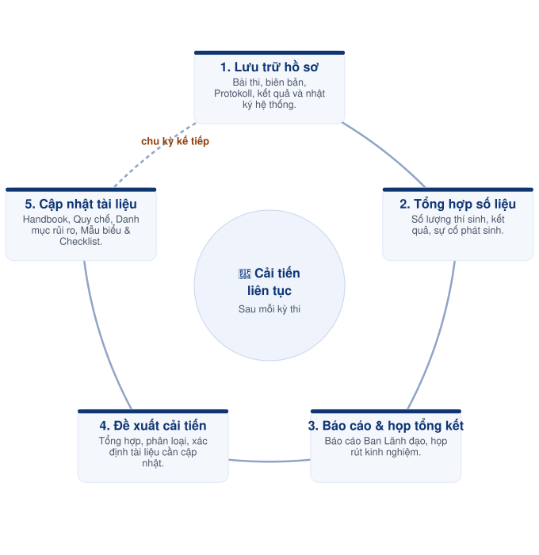

# Bước 12 — Lưu trữ, tổng kết & cải tiến



#### 📅 Thời điểm

Trong vòng 2–4 tuần sau khi hoàn tất kỳ thi.



#### 👤 Phụ trách

Exam Coordinator



#### ✅ Phê duyệt

Exam Director



***

### 👥 Vai trò & Trách nhiệm

| Vai trò          | Trách nhiệm                                                                 |
| ---------------- | --------------------------------------------------------------------------- |
| Exam Coordinator | Lưu trữ hồ sơ, tổng hợp báo cáo, tổ chức họp tổng kết và cập nhật tài liệu. |
| Exam Director    | Phê duyệt báo cáo tổng kết và các đề xuất cải tiến.                         |

### 📋 Chuẩn bị

* 📄 Hồ sơ kỳ thi.
* 📄 Báo cáo kết quả kỳ thi.
* 📄 Biên bản họp tổng kết.
* 📄 Danh sách đề xuất cải tiến.
* 💻 Operation Handbook.
* 💻 Danh mục rủi ro.

***

### ⚠️ Quy tắc thực hiện


### Lưu trữ hồ sơ

* Chỉ lưu trữ sau khi toàn bộ quy trình của kỳ thi đã hoàn tất.
* Hồ sơ phải được lưu đầy đủ, đúng danh mục và đúng thời hạn lưu trữ.
* Không tự ý hủy hoặc chỉnh sửa hồ sơ sau khi lưu.



### Báo cáo và tổng kết

* Báo cáo phải phản ánh đúng số liệu và tình hình thực tế của kỳ thi.
* Các vấn đề phát sinh phải được ghi nhận đầy đủ, không bỏ sót.



### Cải tiến quy trình

* Mọi đề xuất cải tiến được thống nhất phải được cập nhật vào tài liệu chính thức.
* Không lưu nội dung cải tiến chỉ trong biên bản họp.
* Chỉ cập nhật Handbook sau khi được Exam Director phê duyệt.


***

<figure><figcaption>
Vòng lặp lưu trữ, tổng kết &#x26; cải tiến
</figcaption></figure>

***

## 📖 Hướng dẫn thực hiện



### Lưu trữ hồ sơ

* Lưu hồ sơ thí sinh.
* Lưu bài thi, biên bản và Protokoll.
* Lưu kết quả kỳ thi.
* Lưu các tài liệu và nhật ký hệ thống liên quan.



### Tổng hợp số liệu

* Tổng hợp số lượng thí sinh.
* Tổng hợp kết quả kỳ thi.
* Tổng hợp các sự cố và tình huống phát sinh.
* Chuẩn bị báo cáo tổng kết.



### Báo cáo và họp tổng kết

* Báo cáo kết quả kỳ thi với Ban Lãnh đạo.
* Tổ chức họp rút kinh nghiệm.
* Đánh giá các nội dung về vận hành, nhân sự, kỹ thuật và chuyên môn.



### Đề xuất cải tiến

* Tổng hợp các đề xuất cải tiến đã được thống nhất.
* Phân loại theo từng nhóm nội dung.
* Xác định tài liệu cần cập nhật.



### Cập nhật tài liệu

* Cập nhật Operation Handbook (nếu cần).
* Cập nhật Quy chế (nếu cần).
* Cập nhật Danh mục rủi ro (nếu cần).
* Cập nhật Mẫu biểu & Checklist (nếu cần).
* Ghi nhận lịch sử thay đổi của tài liệu.



***




### Checklist hoàn thành

* [ ] Hồ sơ kỳ thi đã được lưu trữ đầy đủ.
* [ ] Báo cáo tổng kết đã hoàn thành.
* [ ] Đã tổ chức họp rút kinh nghiệm.
* [ ] Đã tổng hợp các đề xuất cải tiến.
* [ ] Đã cập nhật tài liệu liên quan (nếu có).





### Hoàn thành khi

* Hồ sơ kỳ thi đã được lưu trữ đầy đủ theo quy định.
* Báo cáo tổng kết đã được phê duyệt.
* Các nội dung cải tiến đã được cập nhật vào tài liệu chính thức.
* Kỳ thi được xác nhận hoàn tất và sẵn sàng khởi động chu kỳ tổ chức tiếp theo.





### Lưu ý

* Không lưu các đề xuất cải tiến chỉ trong biên bản họp.
* Mọi cải tiến đã được thống nhất phải được cập nhật vào đúng tài liệu liên quan (Operation Handbook, Quy chế, Danh mục rủi ro hoặc Mẫu biểu & Checklist).
* Chỉ cập nhật tài liệu sau khi được Exam Director phê duyệt.


***

## 📎 Tài liệu liên quan


[buoc-11-cap-phat-chung-chi.md](buoc-11-cap-phat-chung-chi.md)



[ban-hanh-quy-che.md](../01-policies/ban-hanh-quy-che.md)



[risk-register.md](../05-risk-management/risk-register.md)



[bieu-mau.md](../04-templates-checklists/bieu-mau.md)



[checklist.md](../04-templates-checklists/checklist.md)

