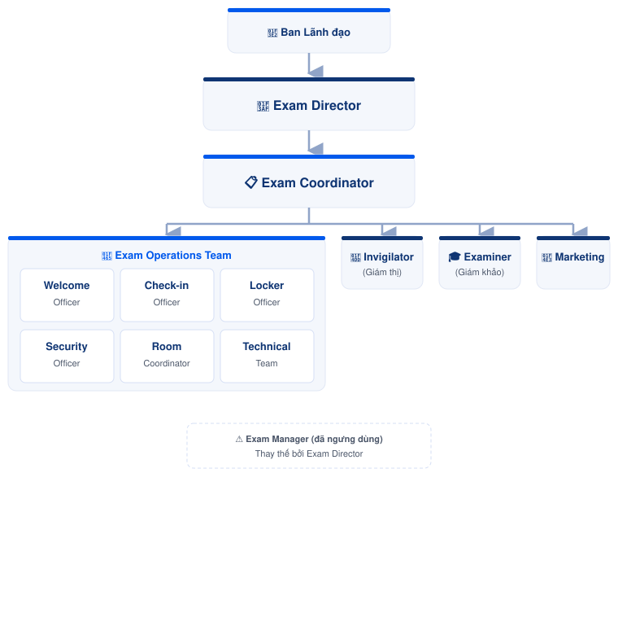

---
layout:
  width: wide
  title:
    visible: true
  description:
    visible: true
  tableOfContents:
    visible: true
  outline:
    visible: false
  pagination:
    visible: true
  metadata:
    visible: false
  tags:
    visible: true
  actions:
    visible: true
---

# Vai trò & Phân quyền

Tổng hợp các vai trò tham gia trong quy trình tổ chức kỳ thi ÖSD tại PNE. Mỗi vai trò có phạm vi trách nhiệm, quyền hạn và hướng dẫn công việc riêng nhằm đảm bảo kỳ thi được triển khai thống nhất và đúng quy trình.

<figure><figcaption>
Sơ đồ tổ chức
</figcaption></figure>


Mỗi trang vai trò mô tả **trách nhiệm**, **phạm vi công việc**, **quyền hạn**, **quy trình tham gia** và các **tài liệu liên quan**. Khi thực hiện công việc, luôn ưu tiên tra cứu hướng dẫn tại đúng vai trò phụ trách.


***

## 🗂️ Sơ đồ tổ chức

<figure><figcaption>
Sơ đồ báo cáo giữa các vai trò
</figcaption></figure>

***

## 👔 Ban điều hành kỳ thi

<table data-view="cards">
<thead>
<tr>
<th></th>
<th></th>
<th data-hidden data-card-target data-type="content-ref"></th>
</tr>
</thead>
<tbody>

<tr>
<td>🎯</td>
<td>

### Exam Director

Phê duyệt, giám sát và chịu trách nhiệm cao nhất đối với kỳ thi.

</td>
<td>
<a href="exam-director.md">exam-director.md</a>
</td>
</tr>

<tr>
<td>📋</td>
<td>

### Exam Coordinator

Điều phối toàn bộ quy trình tổ chức kỳ thi từ lập kế hoạch đến khi hoàn tất lưu trữ và cải tiến.

</td>
<td>
<a href="exam-coordinator.md">exam-coordinator.md</a>
</td>
</tr>

</tbody>
</table>

***

## 🏫 Nhóm vận hành kỳ thi

<table data-view="cards">
<thead>
<tr>
<th></th>
<th></th>
<th data-hidden data-card-target data-type="content-ref"></th>
</tr>
</thead>
<tbody>

<tr>
<td>👥</td>
<td>

### Exam Operations Team

Nhóm nhân sự trực tiếp phục vụ, hướng dẫn và điều phối thí sinh tại điểm thi.

</td>
<td>
<a href="exam-operations-team/README.md">README.md</a>
</td>
</tr>

</tbody>
</table>

### Thành viên Exam Operations Team






[welcome-officer.md](exam-operations-team/welcome-officer.md)



[check-in-officer.md](exam-operations-team/check-in-officer.md)



[locker-officer.md](exam-operations-team/locker-officer.md)







[security-officer.md](exam-operations-team/security-officer.md)



[room-coordinator.md](exam-operations-team/room-coordinator.md)



[technical-team.md](exam-operations-team/technical-team.md)






***

## 📝 Nhóm chuyên môn

<table data-view="cards">
<thead>
<tr>
<th></th>
<th></th>
<th data-hidden data-card-target data-type="content-ref"></th>
</tr>
</thead>
<tbody>

<tr>
<td>🎓</td>
<td>

### Examiner (Giám khảo)

Đánh giá và chấm điểm phần thi Nói theo quy định của ÖSD.

</td>
<td>
<a href="examiner.md">examiner.md</a>
</td>
</tr>

<tr>
<td>📄</td>
<td>

### Invigilator (Giám thị)

Điều hành và giám sát phòng thi, đảm bảo kỳ thi diễn ra đúng quy chế.

</td>
<td>
<a href="invigilator.md">invigilator.md</a>
</td>
</tr>

</tbody>
</table>

***

## 📢 Hỗ trợ

<table data-view="cards">
<thead>
<tr>
<th></th>
<th></th>
<th data-hidden data-card-target data-type="content-ref"></th>
</tr>
</thead>
<tbody>

<tr>
<td>📣</td>
<td>

### Phòng Marketing

Phụ trách truyền thông, tiếp nhận đăng ký và hỗ trợ thông tin cho thí sinh trước kỳ thi.

</td>
<td>
<a href="marketing.md">marketing.md</a>
</td>
</tr>

</tbody>
</table>

***


### Vai trò đã ngưng sử dụng

**Exam Manager** là vai trò được sử dụng trong các quy trình trước đây và đã được thay thế bởi **Exam Director**.


[exam-manager.md](exam-manager.md)


