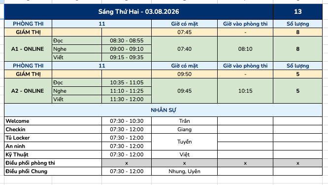

# Bảng phân ca nhân sự theo ngày thi


Đây là bản nháp — cần Exam Coordinator rà soát và điều chỉnh trước khi áp dụng chính thức. Số lượng phòng, giám thị và nhân sự phụ thuộc số lượng thí sinh thực tế của từng buổi thi.


Biểu mẫu này dùng để lập lịch phân ca chi tiết cho từng buổi thi (Sáng/Chiều) — ai trực vị trí nào, giờ nào, phòng nào — dựa trên nguyên tắc phân công đã nêu tại [Bước 5](../02-processes/buoc-05-phan-cong-va-csvc.md) và [Checklist Phân công Nhân sự](checklist-phan-cong-nhan-su.md).

## 🖼️ Ví dụ minh họa

<figure><figcaption>
Ví dụ bảng phân ca một buổi thi thực tế
</figcaption></figure>

***

## 📋 Mẫu bảng — [Buổi] Thứ [x] – [dd.mm.yyyy]

Tổng số thí sinh buổi này: **___**


Lặp lại khối "Phòng thi" bên dưới cho mỗi phòng thi trong buổi. Với phần thi Nói/Speaking, có thể bỏ bảng kỹ năng và chỉ cần dòng Giờ có mặt/Giờ vào phòng thi chung.


### Phòng thi [số phòng] — [Trình độ · Hình thức thi]

| Giám thị | Giờ có mặt | Giờ vào phòng thi | Số lượng |
| --- | --- | --- | --- |
| Tên 1 – Tên 2 | ___ | ___ | ___ |

| Kỹ năng | Giờ thi | Giờ có mặt | Giờ vào phòng thi |
| --- | --- | --- | --- |
| Đọc | ___ | ___ | ___ |
| Nghe | ___ | ___ | ___ |
| Viết | ___ | ___ | ___ |

***

## 👥 Nhân sự

| Vị trí | Giờ làm việc | Người phụ trách |
| --- | --- | --- |
| Welcome | ___ | ___ |
| Check-in | ___ | ___ |
| Tủ Locker | ___ | ___ |
| An ninh | ___ | ___ |
| Kỹ thuật | ___ | ___ |
| Điều phối phòng thi | ___ | ___ |
| Điều phối chung | ___ | ___ |


Nhắc lại nguyên tắc từ Checklist Phân công Nhân sự: nếu không quá thiếu nhân sự, mỗi người **không nên làm việc full ngày** — nên chia ca sáng/chiều riêng.


***

## 📎 Tài liệu liên quan


[Bước 5 — Phân công nhân sự & CSVC](../02-processes/buoc-05-phan-cong-va-csvc.md)



[Bước 7 — Tổ chức Kỳ thi](../02-processes/buoc-07-to-chuc-ky-thi/README.md)



[checklist-phan-cong-nhan-su.md](checklist-phan-cong-nhan-su.md)

